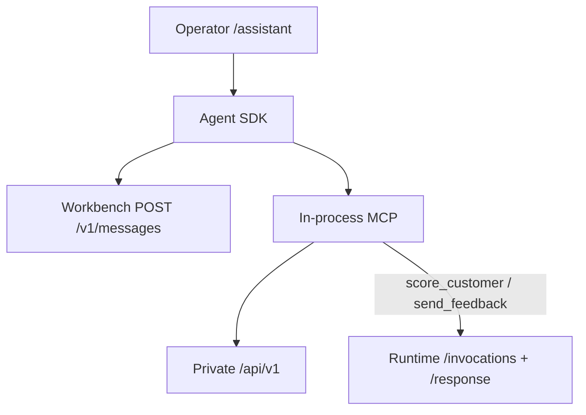

import { BlogHeader } from '@/components/blog/BlogHeader'
import { Callout } from 'nextra/components'

<BlogHeader title="Agentic capabilities when creating recommenders" date="2026/09/18" description="How Workbench2’s Ecosystem Agent was built — and the capabilities that speed up recommender project creation, scoring, and day-two maintenance." authorid="jayvanzyl" ogImage="/images/blog/2026-09-18-agentic-recommenders-slots.png" />

A recommender is not a prompt. It is a project, an offer catalog, a Dynamic Engagement (or Two-Tower, or personality pipeline), a Runtime deployment, and a closed loop that actually learns. The slow part is rarely “pick an algorithm.” It is wiring those pieces without inventing configuration, then keeping them honest after the first scores land.

Workbench2’s **Ecosystem Agent** is the operator we built for that work. It sits in `/assistant`, talks only through Workbench MCP, and treats the form you have open as live context. It does **not** chat with customers — that is EcoGentic. It does **not** score campaigns by guessing — that is Runtime `POST /invocations` then `POST /response`.

This post explains how that agent was built, then lists the capabilities you can use today to create and maintain recommender projects faster.

## What we built (and what we refused to build)

The Ecosystem Agent is a Workbench **operator**, implemented with the Claude Agent SDK, but **model traffic never goes to Anthropic**. Every turn hits Workbench `POST /v1/messages` and the **default** LLM configured under Administration. There is no `sk-ant-` key in the image.

Three design rules from day one:

1. **Tools only.** Allowed: Workbench MCP tools (`mcp__ecosystem-workbench`). Disallowed: Bash, Write, Edit, WebSearch. The agent cannot shell out or rewrite your repo.
2. **Confirm before mutate.** `call_endpoint`, `entity`, and `update_current_form` need `confirm=true`. The operator still **Saves** the form.
3. **Ground in this platform.** Algorithm names come from `recommend_algorithm` / `explain_algorithms`. Convergence advice comes from `explain_convergence`. Navigation comes from the Workbench product guide. Numbers come from tool results. The agent is not allowed to invent approach IDs, scores, or deployment names.

That is the opposite of a generic coding copilot glued onto a recommender UI.

External Cursor / Claude Code can attach the same tools over `POST /mcp` with a Workbench JWT and a public credential (`ewb_public_…`). In-app chat does not need that key. Runtime builtin MCP (`POST` on the scoring host) is a **different** server — use it for `invoke` / `response`, not for editing Dynamic Engagement documents.

## Contextual intelligence: the open form is the working set

When you are on an editor, Workbench appends a `[Current form]` stanza: collection, id, dirty flag, and the live (possibly unsaved) JSON. The agent treats that document as the working set.

| Operator says | Agent does |
| --- | --- |
| “Explain this” / “explain this project” | MCP `explain_entity` — answers from the document + registry metadata |
| “Set epsilon to …” / “bind gender as a campaign param” | `update_current_form` with a patch (`confirm=true`) — **you** review and Save |
| “Create / persist this” | `entity` CRUD on `/api/v1/entities/<collection>` (`confirm=true`) |

List pages do not send a document. The agent must not invent one.

That loop is how maintenance stays fast: you stay on Dynamic Engagement, ask why an arm is stuck, get an explanation grounded in **this** config, then accept a patch instead of re-keying JSON.

## Generate the project, then specialize the recommender

On [Projects](/docs/configuration/project) use **Generate project**. Natural language is classified into platform features (offer matrix, whitelist, budget, lookup from data, generative, champion-challenger, and so on). The generator creates assets in a fixed order so UUIDs actually link:

1. Dynamic Engagement first (gets a UUID)
2. Deployment step, with `pulse_responder_uuid` pointed at that engagement
3. Project wrapping both

Post-score plugins follow the same product rules the Runtime uses. Dynamic and static scoring both default to `PlatformDynamicEngagement`. Spend / money personality and offer-matrix recommenders pick their dedicated post-score classes. Pre-score and reward stay on the platform defaults unless you override them.

Then ask the Ecosystem Agent **which approach to use**. It calls `recommend_algorithm` and answers in **dropdown names** (Ecosystem Rewards Algorithm, Two-Tower Similarity, H2O MOJO, Spend Personality, Network Selector). Runtime `approach` / `sub_approach` IDs belong in a config snippet, not in chat. Human Behavioral Algorithm always needs a type — Loss Aversion if you do not specify one.

<Callout type="info">
Network Analysis Algorithm (PageRank **inside** one Dynamic Engagement) is not Network Selector (traffic split / champion-challenger across runtimes). The agent is taught that fork on purpose.
</Callout>

## Capability map: accelerate creation

These are the capabilities we wired so a recommender project does not start from a blank Mongo document.

### 1. Orient without a tribal wiki

`describe_workbench` and `explain_workbench` answer “where is Dynamic Engagement?” with clickable paths (`/entities/dynamic_engagement`, `/entities/offer_matrix`, `/runtime-console`, `/assistant`). The source is the committed Workbench operator guide, not a hallucinated sitemap.

### 2. Discover the real API

`list_api_catalog` returns the Public API Access catalog — scopes and `/public/v1` routes — so notebooks and MCP clients use the same surface as Administration → API Keys. `call_endpoint` is the escape hatch when a typed tool does not exist. Mutations still need confirm.

### 3. Bind offers and identity

Offer Matrix is first-class (`/entities/offer_matrix`). Feedback matching on Runtime uses `offer_name` (or `offer` / `offer_treatment_code`) plus the `uuid` from `final_result`. The agent is instructed to copy those from the score tool, never to invent them.

### 4. Configure learning where it lives

Dynamic Experimentation is the `dynamic_engagement` entity plus Runtime scoring. The agent does not invent a second experiment engine. Training fields, epsilon, rewards, and windows are edited on the open form or explained via `explain_algorithms` / `explain_convergence`.

### 5. Ground offers in business language

Ontology tools (`list_ontologies`, `describe_ontology`, `resolve_ontology_term`, `generate_ontology_query`, `query_data_via_ontology`) map “customers older than 40” onto enabled Mongo/Trino mappings. Campaigns and scoring resolve terms to fields; they do not query Turtle by hand. If Ontology Management is off, the agent says so and falls back.

### 6. Score a real deployment

`list_deployments` → `score_customer` → ranked offers from the tool only → on accept, `send_feedback` with that row’s `uuid` and `offer_name`. That wraps the Runtime closed loop. `params` remains a JSON **string** (empty object `"{}"` as a string, or encoded `input` / `value` arrays). Never a nested object.

### 7. Attach campaigns without confusing channels

Intelligent Sales lists delivery channels (email, WhatsApp, Python, …), assigns published options, triggers sample vs production runs, and drafts cron from plain English. Runtime scoring `channel` (`app` / `web` / `api`) is a different field. The skills keep those apart.

## Capability map: accelerate maintenance

Creation is half the cost. These capabilities are for the week after go-live.

| Need | Capability | What it actually does |
| --- | --- | --- |
| “Why is this config like this?” | `explain_entity` | Read-only markdown from the live form + entity metadata |
| “Why aren’t scores moving?” | `explain_convergence` | Priors, `alpha_zero` / `beta_zero`, training cells, epsilon — from the Model Convergence guide, not generic bandit folklore |
| “Change this field” | `update_current_form` | Patch the editor; you Save |
| “Did learning happen?” | `send_feedback` / Runtime `/response` | Same `uuid` ties ContactLog to ResponseLog |
| “Rehearse traffic” | [Simulations](/docs/configuration/simulations) | Workbench `/entities/simulation` — Save anytime; Run when connections validate |
| “Is the campaign wired?” | Channel tools + Runtime Console | Delivery vs scoring; campaign BDD on the Runtime Dashboard |
| “Personality drift” | Spend/money MCP + public `/runs` | Phased pipelines; poll jobs — not a one-shot notebook forever |

Closed loop reminder: `POST /invocations` ranks. `POST /response` (singular) with `uuid` + `offer_name` is what the rolling process counts as success. Thompson samples the stored Beta. Unbinned numeric training fields make every cell `n=1` — the convergence skill is there so that diagnosis is repeatable.

## Skills we ship with the operator

Committed operator skills (Workbench `.claude/skills/`) are the playbooks the agent follows:

| Skill | When you use it |
| --- | --- |
| `claude-operator` | Default MCP-only policy |
| `workbench-navigator` | Where / what / Path links |
| `algorithm-selection` | Which approach; explain catalog |
| `dynamic-experimentation` | Configure DE + learning loop |
| `model-convergence` | Priors, stalls, levers |
| `real-time-recommender` | Score + `/response` |
| `intelligent-sales` | Campaigns and delivery channels |
| `ontology-data` | Terms → mapped queries |
| `spend-personality` / `money-personality` / `predictive-personality` | Trait pipelines composed with a live score |
| `conversational` | EcoGentic journeys — not `/assistant` |
| `interaction-science` | Sentimental equilibrium |

Administration → Agents is the catalog of those product agents plus the Ecosystem Agent itself. Coverage is `wired` / `partial` / `gap` on purpose — we do not pretend every row is fully autonomous.

## A concrete recommender session

1. In Workbench, open **Projects** → **Generate project**: “Next-best offer on app, learn online from accept, use our offer matrix.”
2. Open the generated Dynamic Engagement. Ask the agent: “Explain this.” It calls `explain_entity`.
3. “Which algorithm?” → `recommend_algorithm` (likely a Dynamic Engagement family; dropdown name, not a guessed ID).
4. Push the deployment. In Runtime Console or via the agent: `list_deployments`, `score_customer` for a known `customer_id`.
5. Accept an offer in the tester (or `send_feedback`) with the returned `uuid` and `offer_name`.
6. A week later: “Why is offer B stuck at the prior?” → `explain_convergence` on this form. Patch training fields or epsilon via `update_current_form`. Save. Re-score.

That is project creation **and** maintenance in the same agent, on the same MCP contract.

## What not to mix

| Surface | Job |
| --- | --- |
| Ecosystem Agent `/assistant` | Operators, config, explain, score via a **deployment** |
| EcoGentic `/ecogentic` | Customer journeys |
| Data Agents | Analytics jobs and markdown reports |
| Runtime `POST /mcp` | `invoke` / `response` / ontology validators on the Java engine |
| Workbench `POST /mcp` | Deployments, entities, enrichment, public catalog |

If you point Cursor at the wrong `/mcp`, you will not see `list_api_catalog` on Runtime, and you will not see `invoke` on Workbench. That split is intentional.

## Start

- In Workbench: header **Ecosystem Agent**, or `/assistant`
- Catalog: **Administration → Agents**
- Keys for external attach: **Administration → API Keys → Public API Access**
- Platform docs: [Public APIs, Agents & MCP](/docs/configuration/workbench_apis), [Runtime MCP](/docs/runtime/mcp), [Closed-loop API](/docs/runtime/access)

The agent is there to shorten the distance between “we need a recommender” and a deployment that can learn — without letting a general-purpose model invent the platform.
