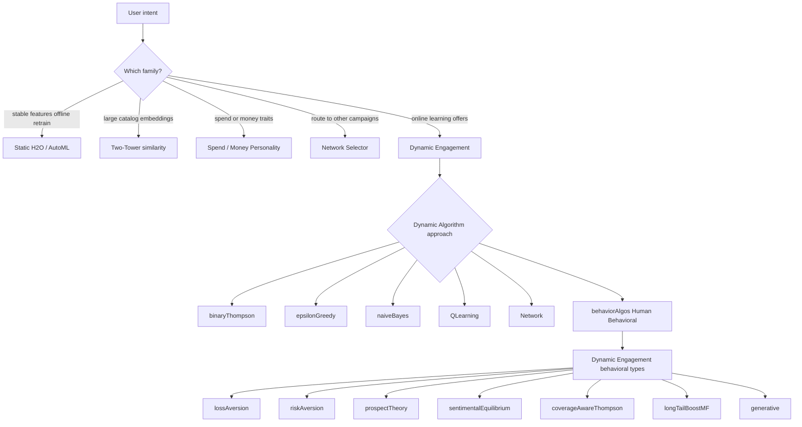

# Parameters

Dynamic Interactions are used to implement a class of prediction problem where the rate of change is moderate to high and model convergence is required in very short intervals. Each algorithm has it's own approach and set of conditions under which it will operate.

## Settings
Name your dynamic model using the same name as the project deployment step. When you change the name it will create a copy of the configuration. The Feature Store Database with Feature Store Collection/Table is used to generate the options store (use Generate option in VARIABLE tab). The option store is used by the client pulse responder to update values in real-time.


Note that dynamic configurations are stored in ecosystem_meta.dynamic_engagement. The generated properties will be updated when project is pushed.

## Engagement
This is where you select the algorithm that is best for your use case.


### Selection tree

Dynamic Engagement uses a **Dynamic Algorithm** (`approach`). When you select **Human Behavioral** (`behaviorAlgos`), choose a **behavioral type** (`sub_approach`) in the second dropdown.



See the full [Algorithms Overview](/docs/configuration/algorithms) for comparison tables, cold-start behavior, and scenario guides.

### Dynamic Algorithms

#### [Ecosystem Rewards Algorithm](/docs/configuration/algorithms/ecosystemrewards) (`binaryThompson`)

Default Dynamic Engagement algorithm. Thompson Sampling with Beta distributions per offer/segment. Best general-purpose choice and strong cold start (Beta(1,1) prior).

#### [Epsilon Greedy](/docs/configuration/algorithms/epsilongreedy) (`epsilonGreedy`)

Simplest bandit: with probability ε explore randomly, else exploit highest empirical rate. Good for explainable A/B testing.

#### [Bayesian Probabilistic](/docs/configuration/algorithms/baysianprobabilistic) (`naiveBayes`)

Naive Bayes over discrete features. Less focus on explore/exploit; uses Lookup Parameters for inference variables. Runtime uses Bernoulli Naive Bayes.

#### [Q-learning](/docs/configuration/algorithms/qlearning) (`QLearning`)

Sequential reinforcement learning per customer. Requires Lookup Parameters and a custom Java reward plugin. Use when the next offer depends on prior accepts.

#### [Network Analysis](/docs/configuration/algorithms/networkanalysis) (`Network`)

PageRank on offer co-occurrence graph. Requires co-presentation history and Lookup Parameters for network nodes. Not the same as the [Network Selector](/docs/user_guides/network) (traffic routing).

#### Human Behavioral Algorithm (`behaviorAlgos`)

Select this Dynamic Algorithm when you want a behavioral type below. **You must also set `sub_approach`.** If omitted, runtime defaults to Loss Aversion.

##### Dynamic Engagement behavioral types

| `sub_approach` | Algorithm |
|----------------|-----------|
| `lossAversion` | [Loss Aversion](/docs/configuration/algorithms/lossaversion) — penalize ignored offers; UCB exploration (default type) |
| `riskAversion` | [Risk Aversion](/docs/configuration/algorithms/riskaversion) — mean-variance; steady predictable uptake |
| `prospectTheory` | [Prospect Theory](/docs/configuration/algorithms/prospecttheory) — Kahneman–Tversky value weighting |
| `sentimentalEquilibrium` | [Sentimental Equilibrium](/docs/configuration/algorithms/sentimentalequilibrium) — engagement equilibrium (not per-offer ranking) |
| `coverageAwareThompson` | [Coverage-Aware Thompson](/docs/configuration/algorithms/coveragethompson) — long-tail / fairness |
| `longTailBoostMF` | [Long-Tail Boost MF](/docs/configuration/algorithms/longtailmf) — WRMF + inverse exposure |
| `generative` | [Generative Model](/docs/configuration/algorithms/generativemodel) — LLM prompt scoring |

All behavioral types require **Lookup Parameters**. Generative also needs `randomisation.prompt` and `randomisation.prompt_parameters`.

## Variables
There are a number of options when configuring variables. An offer/message/nudge/option/etc is needed from the feature store as configured in ```Settings```. If customer level tracking and model convergence is required then use ```params.value``` as it contains the customer number in the contact logs.


Use the ```Generate``` button to generate a new options store from the settings. Ensure that the initial feature store contains a fairly complete list of items for cold-start to be effective. Example data set: customer (Tracking Key), product (Offer Key), category (Variable One), category (Variable Two). Defaults are extracted from defined Feature Store and the Options Store will be generated.

Use ```Update``` capability if you have an existing options store that needs updating. It will not re-generate the options store, but only add or update the options that are out of date. All scores will be retained and defaults will be used for added options only.

## Options
Note that the Options table will change depending on the algorithm.

This is the option store display for Bayesian Probabilistic Approach:


This is the option store display for Ecosystem Rewards Approach:

