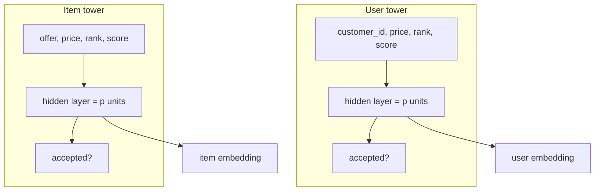

import { Callout } from 'nextra/components'

# Architecture & Theory

## The dual-encoder idea

A two-tower model learns **two functions** that project different entities into a
**single shared vector space**:

- the **user tower** $f_u(\cdot)$ maps a customer's features $x_u$ to a vector
  $u = f_u(x_u) \in \mathbb{R}^p$,
- the **item tower** $f_i(\cdot)$ maps an offer's features $x_i$ to a vector
  $v = f_i(x_i) \in \mathbb{R}^p$.

The model is trained so that customers and the offers they engage with land
**close together** in that space. Compatibility is then just a similarity
between two vectors.

## The similarity score

ecosystem.Ai scores a customer/offer pair with the **dot product of the
L2-normalized embeddings**:

$$
\hat{u} = \frac{u}{\lVert u \rVert_2}, \qquad
\hat{v} = \frac{v}{\lVert v \rVert_2}, \qquad
\text{score}(u, v) = \hat{u} \cdot \hat{v}
$$

Because both vectors are unit length, the dot product equals the **cosine
similarity**, bounded in $[-1, 1]$. Higher means more compatible.

<Callout type="tip" title="Why normalize">
  L2-normalization makes scores comparable across customers and offers (vector
  *magnitude* no longer affects ranking, only *direction*), and it makes the
  Java runtime's cosine and the training-time dot product agree.
</Callout>

## The two towers in ecosystem.Ai

The built-in workbench implementation trains both towers as **H2O Deep Learning**
networks and reads the **first hidden layer** as the embedding.

| Tower | Inputs (features) | Target | Embedding source |
| --- | --- | --- | --- |
| **User** | `customer_id`, `price`, `rank`, `score` | `accepted` (0/1) | `deepfeatures(layer=0)` |
| **Item** | `offer`, `price`, `rank`, `score` | `accepted` (0/1) | `deepfeatures(layer=0)` |

Each tower is a classifier of "did the customer accept?", and the **hidden-layer
activations** become the embedding. With `hidden=[embedding_dim]`, the single
hidden layer *is* the *p*-dimensional vector.

## Retrieval versus ranking

Two-tower models shine at **retrieval**: with item vectors precomputed, finding
the best offers for a customer is a nearest-neighbour search over vectors —
cheap even across very large catalogues.

| Property | Two-tower (retrieval) | Cross-feature ranker |
| --- | --- | --- |
| User/item interaction | late (dot product only) | early (joint features) |
| Item vectors precomputable | yes | no |
| Cost per candidate | one dot product | a full model score |
| Typical use | shortlist thousands → hundreds | re-rank a small shortlist |

In ecosystem.Ai the same dot-product is used directly for ranking the
**offer matrix** at request time, because the offer matrix is already a curated
candidate set. For very large catalogues you would precompute item vectors and
use an approximate nearest-neighbour (ANN) index in front of the runtime.

## Engine independence

Nothing about the scoring math depends on **how** the towers were trained. The
runtime consumes **embedding vectors**:

- **H2O Deep Learning** towers (workbench) → `deepfeatures(layer=0)` + L2 norm.
- **PyTorch** towers (notebooks sidecar) → the tower's output vector.

Both produce *p*-dimensional vectors that the runtime compares with cosine / dot
product. See [Model Training](/docs/modules/two_tower/training) and
[PyTorch Serving](/docs/modules/two_tower/pytorch).
