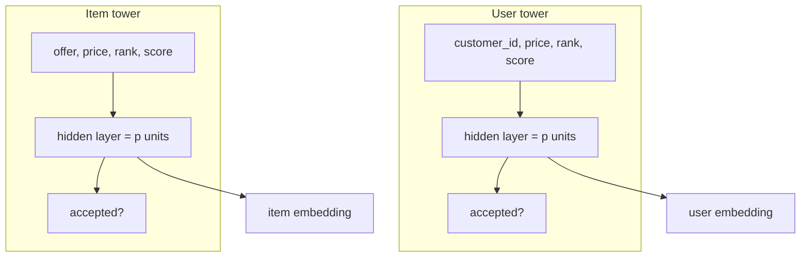
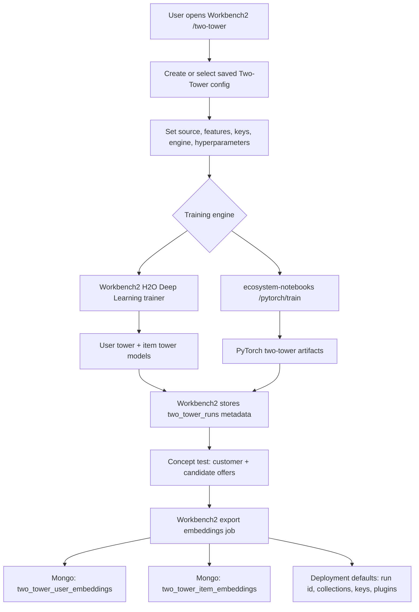
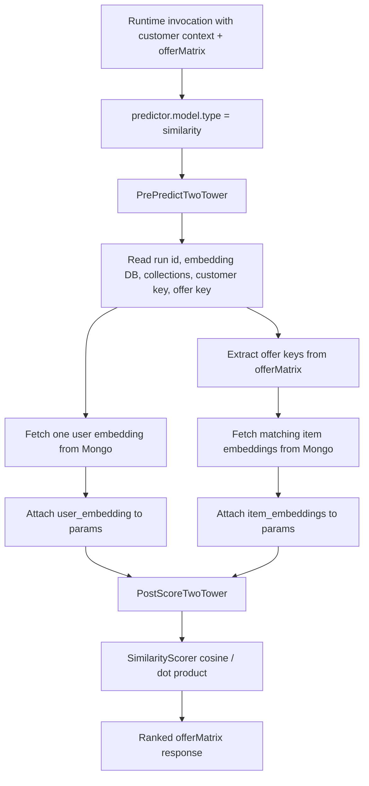

import { Callout } from 'nextra/components'

# Architecture & Theory

## The dual-encoder idea

A two-tower model learns **two functions** that project different entities into a
**single shared vector space**:

- the **user tower** $f_u(\cdot)$ maps a customer's features $x_u$ to a vector
  $u = f_u(x_u) \in \mathbb{R}^p$,
- the **item tower** $f_i(\cdot)$ maps an offer's features $x_i$ to a vector
  $v = f_i(x_i) \in \mathbb{R}^p$.

The model is trained so that customers and the offers they engage with land
**close together** in that space. Compatibility is then just a similarity
between two vectors.

## The similarity score

ecosystem.Ai scores a customer/offer pair with the **dot product of the
L2-normalized embeddings**:

$$
\hat{u} = \frac{u}{\lVert u \rVert_2}, \qquad
\hat{v} = \frac{v}{\lVert v \rVert_2}, \qquad
\text{score}(u, v) = \hat{u} \cdot \hat{v}
$$

Because both vectors are unit length, the dot product equals the **cosine
similarity**, bounded in $[-1, 1]$. Higher means more compatible.

<Callout type="tip" title="Why normalize">
  L2-normalization makes scores comparable across customers and offers (vector
  *magnitude* no longer affects ranking, only *direction*), and it makes the
  Java runtime's cosine and the training-time dot product agree.
</Callout>

## The two towers in ecosystem.Ai

The built-in workbench implementation trains both towers as **H2O Deep Learning**
networks and reads the **first hidden layer** as the embedding.

| Tower | Inputs (features) | Target | Embedding source |
| --- | --- | --- | --- |
| **User** | `customer_id`, `price`, `rank`, `score` | `accepted` (0/1) | `deepfeatures(layer=0)` |
| **Item** | `offer`, `price`, `rank`, `score` | `accepted` (0/1) | `deepfeatures(layer=0)` |

Each tower is a classifier of "did the customer accept?", and the **hidden-layer
activations** become the embedding. With `hidden=[embedding_dim]`, the single
hidden layer *is* the *p*-dimensional vector.

```mermaid
flowchart TB
  subgraph user [User tower]
    xu["customer_id, price, rank, score"] --> hu["hidden layer = p units"] --> au["accepted?"]
  end
  subgraph item [Item tower]
    xi["offer, price, rank, score"] --> hi["hidden layer = p units"] --> ai["accepted?"]
  end
  hu --> uvec["user embedding"]
  hi --> ivec["item embedding"]
```

## How Workbench, notebooks, and runtime work together

The Two-Tower module is split across three ecosystem components, each with a
clear responsibility:

- **Workbench2** is the control plane. Users create saved Two-Tower
  configurations, choose an engine, launch jobs, run concept tests, export
  embeddings, and bind the exported run to a deployment.
- **ecosystem-notebooks** is the PyTorch training and embedding sidecar. It is
  used when the saved configuration selects the `pytorch_notebooks` engine.
- **ecosystem-runtime** is the real-time scoring plane. It does not train
  models; it reads the deployed configuration and ranks the request's offer
  matrix using exported embeddings and similarity scoring.

### Model training and embedding export

Training starts from a saved configuration in Workbench2. The configuration
captures the source data, feature lists, key fields, training hyperparameters,
engine choice, export collections, and deployment defaults. Workbench2 then
dispatches to the selected engine:

- `h2o` uses the built-in Workbench H2O Deep Learning path.
- `pytorch_notebooks` calls `ecosystem-notebooks /pytorch/train` with
  `model_type="two_tower"`.

After training, Workbench2 stores run metadata in `two_tower_runs`, lets the
user run a concept test, and then runs an explicit embedding export job. That
export job writes normalized user and item vectors to MongoDB so runtime scoring
can stay fast and deterministic.

```mermaid
flowchart TD
  User["User opens Workbench2 /two-tower"] --> Config["Create or select saved Two-Tower config"]
  Config --> Params["Set source, features, keys, engine, hyperparameters"]
  Params --> Engine{"Training engine"}

  Engine --> H2O["Workbench2 H2O Deep Learning trainer"]
  Engine --> PT["ecosystem-notebooks /pytorch/train"]

  H2O --> H2OModels["User tower + item tower models"]
  PT --> PTArtifacts["PyTorch two-tower artifacts"]

  H2OModels --> RunMeta["Workbench2 stores two_tower_runs metadata"]
  PTArtifacts --> RunMeta

  RunMeta --> Concept["Concept test: customer + candidate offers"]
  Concept --> Export["Workbench2 export embeddings job"]
  Export --> UserVectors["Mongo: two_tower_user_embeddings"]
  Export --> ItemVectors["Mongo: two_tower_item_embeddings"]
  Export --> DeployDefaults["Deployment defaults: run id, collections, keys, plugins"]
```

This training flow separates **model production** from **runtime use**. H2O and
PyTorch can produce embeddings in different ways, but the exported shape is the
same: keyed, normalized vectors grouped by `run_id`.

### Real-time scoring

Runtime scoring starts after Workbench2 has generated deployment properties for
the selected Two-Tower run. The deployment marks the model as
`predictor.model.type=similarity` and selects the Two-Tower pre/post plugins.
That tells ecosystem-runtime to bypass the normal H2O/dynamic scoring path for
that predictor and use vector similarity instead.

```mermaid
flowchart TD
  Request["Runtime invocation with customer context + offerMatrix"] --> Mode["predictor.model.type = similarity"]
  Mode --> Pre["PrePredictTwoTower"]
  Pre --> Settings["Read run id, embedding DB, collections, customer key, offer key"]
  Settings --> FetchUser["Fetch one user embedding from Mongo"]
  Settings --> OfferKeys["Extract offer keys from offerMatrix"]
  OfferKeys --> FetchItems["Fetch matching item embeddings from Mongo"]
  FetchUser --> Params["Attach user_embedding to params"]
  FetchItems --> Params2["Attach item_embeddings to params"]
  Params --> Post["PostScoreTwoTower"]
  Params2 --> Post
  Post --> Similarity["SimilarityScorer cosine / dot product"]
  Similarity --> Ranked["Ranked offerMatrix response"]
```

In this scoring flow, ecosystem-runtime does not need to load the training
framework or run neural-network inference on every request. It only needs the
customer vector, the candidate offer vectors, and the configured similarity
metric. This keeps the hot path small while still allowing Workbench2 and
ecosystem-notebooks to evolve the training engines independently.

## Retrieval versus ranking

Two-tower models shine at **retrieval**: with item vectors precomputed, finding
the best offers for a customer is a nearest-neighbour search over vectors —
cheap even across very large catalogues.

| Property | Two-tower (retrieval) | Cross-feature ranker |
| --- | --- | --- |
| User/item interaction | late (dot product only) | early (joint features) |
| Item vectors precomputable | yes | no |
| Cost per candidate | one dot product | a full model score |
| Typical use | shortlist thousands → hundreds | re-rank a small shortlist |

In ecosystem.Ai the same dot-product is used directly for ranking the
**offer matrix** at request time, because the offer matrix is already a curated
candidate set. For very large catalogues you would precompute item vectors and
use an approximate nearest-neighbour (ANN) index in front of the runtime.

## Engine independence

Nothing about the scoring math depends on **how** the towers were trained. The
runtime consumes **embedding vectors**:

- **H2O Deep Learning** towers (workbench) → `deepfeatures(layer=0)` + L2 norm.
- **PyTorch** towers (notebooks sidecar) → the tower's output vector.

Both produce *p*-dimensional vectors that the runtime compares with cosine / dot
product. See [Model Training](/docs/modules/two_tower/training) and
[PyTorch Serving](/docs/modules/two_tower/pytorch).
