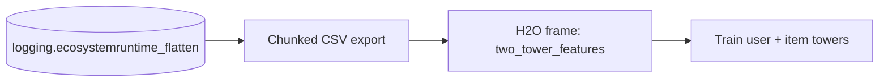

import { Callout } from 'nextra/components'

# Data Preparation

## Source data

Two-tower training reads **interaction-level** rows: one row per customer/offer
exposure, with context numerics and a binary outcome.

| Field | Meaning |
| --- | --- |
| `customer_id` | the customer the offer was shown to |
| `offer` | the offer/product presented |
| `accepted` | `1` if the customer accepted, else `0` (the training target) |
| `price` | offer price at exposure (context) |
| `rank` | the rank the offer was shown at (context) |
| `score` | the model score at exposure (context) |

The default source is the runtime logging collection:

- **Database:** `logging`
- **Collection:** `ecosystemruntime_flatten`

These are produced by the runtime's logging pipeline as interactions accumulate,
so the two-tower model learns directly from real presented/accepted behaviour.

## Selecting a slice

Training is scoped by a **predictor** and an optional **date range**:

- `predictor` — restricts rows to a single deployment/use-case.
- `from_date` / `to_date` — an inclusive-start, exclusive-end window
  (`datetime >= from_date` and `datetime < to_date`).

Two helper endpoints support the UI:

- `GET /api/v1/algorithms/two-tower/predictors` — distinct predictor values.
- `GET /api/v1/algorithms/two-tower/predictor-date-bounds` — min/max dates and
  the row count for a predictor.

## From MongoDB to an H2O frame

Training reuses the shared feature-frame pipeline (the same one used by Spend
Personality): MongoDB documents are exported to **chunked CSV**, then loaded into
an **H2O frame** named `two_tower_features`. Two-tower adds interaction rows but
does not fork the export logic.



The training columns pulled from the frame are:

```text
customer_id, offer, accepted, price, rank, score
```

split into per-tower feature sets:

```text
user tower X: customer_id, price, rank, score
item tower X: offer, price, rank, score
target y   : accepted
```

<Callout type="tip" title="Data hygiene">
  Two-tower quality depends on having enough **accepted** interactions across a
  range of customers and offers. Use the predictor date-bounds endpoint to check
  row counts before training; very sparse windows produce weak embeddings.
</Callout>

Next: [Model Training](/docs/modules/two_tower/training).
