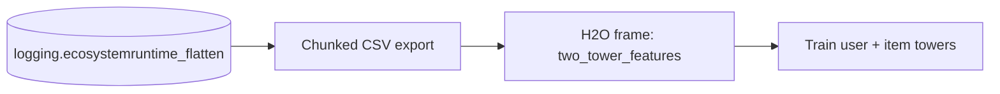

import { Callout } from 'nextra/components'

# Data Preparation

## Source data

Two-tower training reads **interaction-level** rows: one row per customer/offer
exposure, with context numerics and a binary outcome.

| Field | Meaning |
| --- | --- |
| `customer_id` | the customer the offer was shown to |
| `offer` | the offer/product presented |
| `accepted` | `1` if the customer accepted, else `0` (the training target) |
| `price` | offer price at exposure (context) |
| `rank` | the rank the offer was shown at (context) |
| `score` | the model score at exposure (context) |

The default source is the runtime logging collection:

- **Database:** `logging`
- **Collection:** `ecosystemruntime_flatten`

These are produced by the runtime's logging pipeline as interactions accumulate,
so the two-tower model learns directly from real presented/accepted behaviour.

## One interaction dataset, two feature views

The default Workbench flow uses **one training dataset**, not two separate
datasets. The source collection is an interaction table: every row says
"this customer saw this offer/product in this context, and this was the
outcome."

During training, that same row is split into two feature views:

```text
user tower X: customer_id + customer/context features
item tower X: offer/product id + product/context features
target y   : accepted/responded/clicked/etc.
```

Both towers use the same target because the label belongs to the
customer-product interaction. The two trained models learn separate embeddings
from the same interaction evidence, then scoring compares those embeddings with
cosine or dot-product similarity.

Use separate source datasets only when customer profile attributes or product
catalog attributes live outside the interaction collection. In that case,
materialize them into the training frame before training, or configure the
Workbench pipeline so the final training source contains:

- interaction rows with the target label,
- customer-side fields needed by the user tower, and
- product-side fields needed by the item tower.

## Selecting a slice

Training is scoped by a **predictor** and an optional **date range**:

- `predictor` — restricts rows to a single deployment/use-case.
- `from_date` / `to_date` — an inclusive-start, exclusive-end window
  (`datetime >= from_date` and `datetime < to_date`).

Two helper endpoints support the UI:

- `GET /api/v1/algorithms/two-tower/predictors` — distinct predictor values.
- `GET /api/v1/algorithms/two-tower/predictor-date-bounds` — min/max dates and
  the row count for a predictor.

## From MongoDB to an H2O frame

Training reuses the shared feature-frame pipeline (the same one used by Spend
Personality): MongoDB documents are exported to **chunked CSV**, then loaded into
an **H2O frame** named `two_tower_features`. Two-tower adds interaction rows but
does not fork the export logic.


```mermaid
flowchart LR
  mongo[(logging.ecosystemruntime_flatten)] --> csv[Chunked CSV export]
  csv --> frame["H2O frame: two_tower_features"]
  frame --> train["Train user + item towers"]
```

The default training columns pulled from the frame are:

```text
customer_id, offer, accepted, price, rank, score
```

split into per-tower feature sets:

```text
user tower X: customer_id, price, rank, score
item tower X: offer, price, rank, score
target y   : accepted
```

The `/two-tower` configuration can override these defaults. Use the editable
customer key, offer key, user feature list, item feature list, target column,
and categorical columns when your training source has richer customer or product
attributes.

## Many customer and product features

Two-tower models can use many fields, but feature selection still matters. Put
stable customer attributes on the user side, product/catalog attributes on the
item side, and shared exposure context on either side only when it helps the
retrieval task.

Examples:

- Customer/user tower: `customer_id`, segment, geography, lifecycle stage,
  preferences, behavioural aggregates, spend bands, loyalty tier.
- Product/item tower: `offer`, product category, merchant, price bucket,
  margin band, inventory flags, campaign type, eligibility attributes.
- Context: rank, prior score, channel, device, time window, campaign metadata.

High-cardinality identifier fields such as `customer_id` and `offer` should be
categorical. Continuous values should be numeric. Avoid dumping every available
column into both towers: noisy or leakage-prone fields can make embeddings less
portable for real-time scoring. If there are many raw attributes, prefer a
curated set or precomputed aggregates that are available both at training time
and runtime.

<Callout type="tip" title="Data hygiene">
  Two-tower quality depends on having enough **accepted** interactions across a
  range of customers and offers. Use the predictor date-bounds endpoint to check
  row counts before training; very sparse windows produce weak embeddings.
</Callout>

Next: [Model Training](/docs/modules/two_tower/training).
