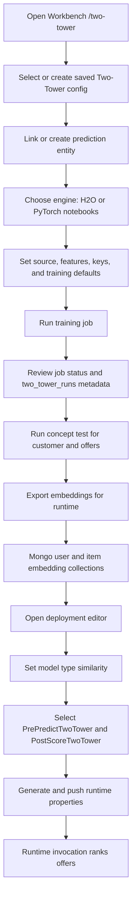

import { Callout } from 'nextra/components'

# Two-Tower Module

## Overview

The **Two-Tower module** brings the **dual-encoder** retrieval pattern to
ecosystem.Ai. It trains two neural "towers":

- a **user (customer) tower** that maps a customer's features into a
  *p*-dimensional vector, and
- an **item (offer/product) tower** that maps each candidate offer into the
  **same** *p*-dimensional space.

Compatibility between a customer and an offer is the **similarity of their two
vectors** — a dot product (or, on unit-normalized vectors, the cosine). Because
the two towers are independent at inference time, item vectors can be
**precomputed once** and a customer is matched against thousands of offers with
nothing more than vector math. This is what makes two-tower models the standard
choice for large-scale **candidate retrieval**.


## Where it fits in ecosystem.Ai

| Stage | Component | Repo |
| --- | --- | --- |
| Configure and operate | `/two-tower` saved configurations, jobs, concept tests, exports | `ecosystem-workbench2` |
| Train towers | H2O Deep Learning or PyTorch engine | `ecosystem-workbench2` / `ecosystem-notebooks` |
| Export embeddings | runtime embedding export job to MongoDB | `ecosystem-workbench2` |
| Real-time scoring | `similarity` model type + `SimilarityScorer` + `PostScoreTwoTower` | `ecosystem-runtime` |
| Storage | embedding collections in MongoDB | shared |

The module is **engine-agnostic**: towers may be trained with **H2O Deep
Learning** (the built-in workbench path) or **PyTorch** (the notebooks sidecar).
Either way the runtime consumes **embedding vectors**, never the model itself, so
real-time scoring carries no model-inference cost in the hot path.

## Main components

| Component | Responsibility |
| --- | --- |
| Two-Tower configuration | saved metadata record describing data source, engine, features, keys, hyperparameters, export collections, and deployment defaults |
| `/two-tower` dashboard | table of saved configs, editable config panel, run buttons, concept test, export status, and per-config job history |
| Python runner | scriptable entry point for train → concept test → export from a saved config or local JSON file |
| H2O engine | trains H2O Deep Learning user/item towers and uses `deepfeatures(layer=0)` for embeddings |
| PyTorch engine | trains `model_type="two_tower"` through `ecosystem-notebooks /pytorch/train` and serves embeddings through `/pytorch/invocations` |
| Embedding export | writes normalized user and item vectors to MongoDB for runtime lookup |
| Runtime plugins | `PrePredictTwoTower` loads vectors; `PostScoreTwoTower` ranks offers with `SimilarityScorer` |

<Callout type="info" title="Two stages, one objective">
  "Two-tower" refers to the **two encoders** trained against a single
  similarity objective. It is distinct from the "two-stage"
  (retrieval-then-ranking) system architecture, although two-tower models are
  the usual choice for the *retrieval* stage of such systems.
</Callout>

## Expected User Flow

The normal user path starts in Workbench on **`/two-tower`** and ends with a
runtime deployment that scores with `PrePredictTwoTower` and `PostScoreTwoTower`.
The important rule is that training a model is not enough: the user must also
**export embeddings** and **bind the exported run** into a deployment step.



Use this checklist when configuring a new Two-Tower deployment:

1. Open **`/two-tower`** in Workbench.
2. Create a saved metadata configuration, or select an existing one from the
   configuration table.
3. Link the configuration to a `predictions` entity. This makes the Two-Tower
   predictor visible to Projects through `project_predictors`.
4. Select the training engine:
   - `h2o` for the built-in Workbench H2O Deep Learning trainer.
   - `pytorch_notebooks` for `ecosystem-notebooks /pytorch/train`.
   - `pytorch_mlrun` only after a two-tower-capable MLRun handler is available.
5. Confirm the data source: usually `logging.ecosystemruntime_flatten`, filtered
   by `predictor` and optional date range.
6. Confirm feature and key fields:
   - user key: `customer_id`
   - item key: `offer`
   - target: `accepted`
   - default context features: `price`, `rank`, `score`
7. Save the configuration so defaults can be reused by the UI and Python runner.
8. Run **Train**. This creates a job and stores run metadata in
   `ecosystem_meta.two_tower_runs`.
9. Run a **Concept Test** with a customer and candidate offers. This validates
   that the embeddings rank offers sensibly before deployment.
10. Run **Export embeddings for runtime**. This writes normalized vectors to:
    - `ecosystem_meta.two_tower_user_embeddings`
    - `ecosystem_meta.two_tower_item_embeddings`
11. Open the Workbench deployment editor for the prediction case.
12. Set **Model Type** to **Two-Tower Similarity** / `similarity`.
13. Bind the exported `run_id`, embedding database, user collection, item
    collection, customer key, and offer key.
14. Select plugin classes:
    - pre-score: `PrePredictTwoTower.java`
    - post-score: `PostScoreTwoTower.java`
15. Generate or push the deployment. Workbench emits:

```properties
predictor.model.type=similarity
predictor.twotower.run.id=tt_abc123
predictor.twotower.embedding.db=ecosystem_meta
predictor.twotower.user.collection=two_tower_user_embeddings
predictor.twotower.item.collection=two_tower_item_embeddings
predictor.twotower.customer.key=customer_id
predictor.twotower.offer.key=offer
plugin.prescore=com.ecosystem.plugin.customer.PrePredictTwoTower
plugin.postscore=com.ecosystem.plugin.customer.PostScoreTwoTower
```

At runtime, `predictor.model.type=similarity` tells the runtime to bypass normal
H2O/dynamic model scoring. `PrePredictTwoTower` loads the configured vectors and
`PostScoreTwoTower` ranks the offer matrix with cosine / dot-product similarity.

## Lifecycle at a glance

1. **[Data Preparation](/docs/modules/two_tower/data)** — interaction rows in
   `logging.ecosystemruntime_flatten` become a training frame.
2. **[Model Training](/docs/modules/two_tower/training)** — a saved
   configuration trains H2O or PyTorch dual towers.
3. **[Offline Scoring](/docs/modules/two_tower/scoring)** — concept tests
   validate the embeddings and an export job writes runtime vectors to MongoDB.
4. **[Real-Time Scoring](/docs/modules/two_tower/runtime)** — the runtime ranks
   offers per request using precomputed (or live PyTorch) embeddings.
5. **[PyTorch Serving](/docs/modules/two_tower/pytorch)** and
   **[API Reference](/docs/modules/two_tower/api)** cover the serving sidecar
   and the full request/response contracts.

## Key properties

- **Shared embedding space** — both towers output the same dimension
  (`embedding_dim`, default `32`).
- **Similarity score** — dot product of L2-normalized vectors (equivalent to
  cosine). See [Architecture & Theory](/docs/modules/two_tower/concepts).
- **Decoupled inference** — item vectors precomputed; only the user vector is
  needed per request.
- **Runtime integration** — a dedicated `similarity` model type bypasses H2O and
  dynamic scoring and routes to the reusable `SimilarityScorer`.
