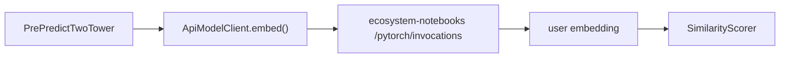

import { Callout } from 'nextra/components'

# PyTorch Serving

This page covers how **PyTorch** powers two-tower (and general) scoring in
ecosystem.Ai. The runtime itself stays lightweight: PyTorch runs in a **sidecar**
(ecosystem-notebooks `/pytorch`), and the runtime talks to it over HTTP.

## Engine options in the runtime

| Engine | Status | Two-tower suitability |
| --- | --- | --- |
| `api:` HTTP serving | **Production** | **Recommended** — PyTorch in a sidecar |
| DJL + TorchScript (in-JVM) | Scaffolding only (Maven `-Pdeep`) | Possible later; single model slot |
| ONNX Runtime | Not present | Would be a new integration |
| Precomputed embeddings | Pattern in use | **Best latency** for items |

The recommended path is **`api:` HTTP serving**: it is already wired through
`ApiModelClient` + `ApiResponseNormalizer`, supports `framework=pytorch`, and
keeps `libtorch` out of the JVM.

## Two implemented `api:pytorch` paths

### 1. General PyTorch model scoring

Register an HTTP-served model directly in `mojo.key`:

```properties
mojo.key=api:pytorch:http://ecosystem-notebooks:8010:my_model_v1
```

The runtime POSTs `{model_id, instances:[features]}` to `{base_url}/invocations`
and normalizes the response into the canonical score shape.

### 2. Two-tower user-tower embedding

For two-tower, the user vector can be computed **live** by the sidecar when no
precomputed vector exists:

```properties
predictor.model.type=similarity
predictor.twotower.user.embed=pytorch:http://ecosystem-notebooks:8010:two_tower_user_v1
```

`PrePredictTwoTower` calls `ApiModelClient.embed(...)`, which POSTs the customer
features to `/pytorch/invocations` and reads the embedding from the response. Item
vectors stay precomputed, so there is **one sidecar call per request**, not one
per offer.



## The sidecar: ecosystem-notebooks `/pytorch`

The concrete PyTorch service lives in **ecosystem-notebooks** (Flask, port
`8010`) and exposes:

| Endpoint | Purpose |
| --- | --- |
| `POST /pytorch/train` | train an MLP or a two-tower model; save artifacts |
| `POST /pytorch/invocations` | score / embed by `model_id` |
| `GET /pytorch/models` | list trained model ids |
| `GET /pytorch/health` | health check |

### Training contract

```json
{
  "model_id": "two_tower_user_v1",
  "model_type": "two_tower",
  "problem_type": "binary_classification",
  "data": {
    "source": { "database": "logging", "collection": "ecosystemruntime_flatten", "pipeline": [], "limit": 100000 },
    "target_column": "accepted",
    "feature_columns": ["customer_id", "price", "rank", "score"],
    "categorical_columns": ["customer_id"],
    "train_test_split": 0.2,
    "random_state": 42
  },
  "hyperparameters": {
    "epochs": 25, "batch_size": 256, "hidden": 64, "learning_rate": 0.001,
    "embedding_dim": 32,
    "user_features": ["customer_id", "price", "rank", "score"],
    "item_features": ["offer", "price", "rank", "score"],
    "user_id_column": "customer_id", "item_id_column": "offer"
  }
}
```

Training data is read from **MongoDB** (`MONGODB_URI`) via the `source` spec; a
`csv_path` (under the existing `DATA_DIR`) or `inline` rows are also accepted.
Artifacts are written under `DATA_DIR/pytorch_models/{model_id}/`.

### Scoring / embedding contract

```json
{
  "model_id": "two_tower_user_v1",
  "instances": [
    { "customer_id": "user_1", "price": 0, "rank": 1, "score": 0, "tower": "user" }
  ]
}
```

Response carries **both** a score and an embedding, so it satisfies general
scoring and `ApiModelClient.embed()`:

```json
{
  "predictions": [ { "prediction": 0.87, "embedding": [0.11, 0.20, 0.07] } ],
  "final_result": [ { "prediction": 0.87, "embedding": [0.11, 0.20, 0.07] } ],
  "framework": "pytorch"
}
```

<Callout type="info" title="Tower hint">
  For `two_tower` models, set `"tower": "user"` or `"tower": "item"` on an
  instance to choose which tower's embedding is returned (default: `user`).
</Callout>

See the full request/response samples in the
[API Reference](/docs/modules/two_tower/api).
