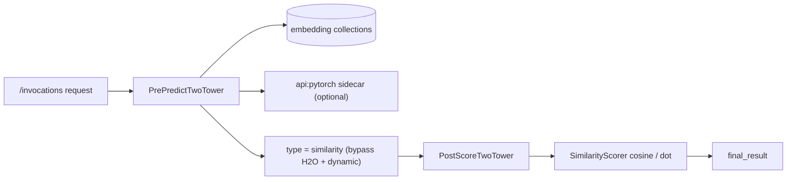

import { Callout } from 'nextra/components'

# Real-Time Scoring

The runtime serves two-tower recommendations **without loading any model**. It
compares a **user embedding** against **item embeddings** with cosine / dot
product and ranks the offer matrix. Embeddings are precomputed in MongoDB, or the
user vector is fetched live from a [PyTorch sidecar](/docs/modules/two_tower/pytorch).

## The `similarity` model type

A campaign tells the runtime to use two-tower scoring with one property:

```properties
predictor.model.type=similarity
```

When this is set, the runtime:

1. **skips H2O model scoring** (no `mojo.key` is required),
2. **skips dynamic-engagement scoring** (`loadCorporaDynamic` is bypassed), and
3. stamps the score result with `type="similarity"`,

then hands off to the post-score plugin. This is the single switch the deployment
step sets; everything else is plugin and embedding configuration.



## The reusable `SimilarityScorer`

`com.ecosystem.algorithm.similarity.SimilarityScorer` is a pure, stateless helper
that **any** post-score plugin can call when the model type is `similarity`. It:

- detects similarity mode (`isSimilarity(...)`),
- extracts the user vector and per-offer item vectors,
- computes `cosine` (default) or `dot` similarity, and
- builds the sorted `final_result`.

Any existing plugin can adopt two-tower scoring with a single guard:

```java
if (SimilarityScorer.isSimilarity(predictModelMojoResult, params)) {
    return getTopScores(params, SimilarityScorer.apply(predictModelMojoResult, params, "cosine"));
}
```

## The plugins

| Plugin | Role |
| --- | --- |
| `PrePredictTwoTower` | loads the user vector + per-offer item vectors into `params` |
| `PostScoreTwoTower` | delegates to `SimilarityScorer`, then `getTopScores` |

`PrePredictTwoTower` resolves the **user embedding** in this order:

1. precomputed vector from `two_tower_user_embeddings` (by `customer_id`);
2. otherwise, if `predictor.twotower.user.embed` is configured, a **live call**
   to the PyTorch sidecar (`ApiModelClient.embed(...)`).

Item vectors come from `two_tower_item_embeddings` (or an `embedding` field on the
offer matrix).

## MongoDB embedding contract

| Collection | Document shape |
| --- | --- |
| `two_tower_user_embeddings` | `{ run_id, customer_id, embedding: [floats] }` |
| `two_tower_item_embeddings` | `{ run_id, offer, embedding: [floats] }` |

Item vectors may instead be attached to each offer-matrix entry as
`"embedding": [floats]`.

## Worked example — campaign properties

```properties
predictor.name=two_tower_demo
predictor.model.type=similarity

# no mojo.key, and no dynamic_engagement corpora

plugin.prescore=com.ecosystem.plugin.customer.PrePredictTwoTower
plugin.postscore=com.ecosystem.plugin.customer.PostScoreTwoTower

# optional: live user-tower embedding via the PyTorch sidecar
predictor.twotower.user.embed=pytorch:http://ecosystem-notebooks:8010:two_tower_user_v1

predictor.offer.matrix={ ... }
```

## Scoring request and response

Request to the runtime (`POST /invocate`):

```json
{
  "campaign": "two_tower_demo",
  "sub-campaign": "default",
  "channel": "web",
  "customer": "user_1",
  "numberoffers": 3,
  "userid": "ecosystem",
  "in_params": { "input": ["customer_id"], "value": ["user_1"] }
}
```

Response (trimmed):

```json
{
  "final_result": [
    { "rank": 1, "result": { "offer": "ProductB", "offer_name": "ProductB", "score": 0.87 } },
    { "rank": 2, "result": { "offer": "ProductC", "offer_name": "ProductC", "score": 0.41 } }
  ],
  "explore": 0,
  "uuid": "..."
}
```

<Callout type="tip" title="Engine-agnostic">
  The runtime never loads a tower. Whether embeddings were produced by H2O
  `deepfeatures` or PyTorch, the runtime only does vector math — so latency stays
  flat and independent of model size.
</Callout>

See the [API Reference](/docs/modules/two_tower/api) for full request/response
samples and [PyTorch Serving](/docs/modules/two_tower/pytorch) for the online
embedding path.
