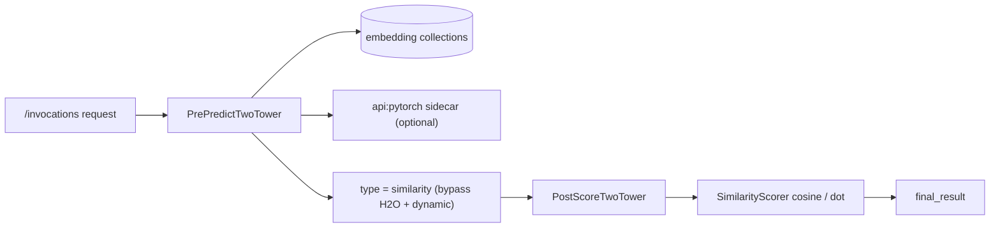
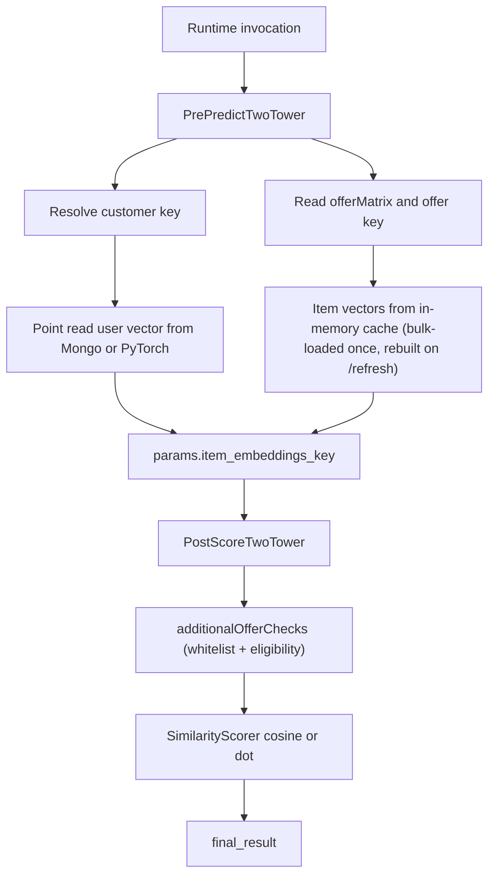

import { Callout } from 'nextra/components'

# Real-Time Scoring

The runtime serves two-tower recommendations **without loading any model**. It
compares a **user embedding** against **item embeddings** with cosine / dot
product and ranks the offer matrix. Embeddings are precomputed in MongoDB, or the
user vector is fetched live from a [PyTorch sidecar](/docs/modules/two_tower/pytorch).

The runtime deployment is bound to an **exported Two-Tower run**. The Workbench
deployment step emits the run id, embedding database, collection names, customer
lookup key, offer-matrix key, and plugin classes. `PrePredictTwoTower` uses those
properties to resolve vectors:

- **User vector** — one indexed point read per request (`{customer_key, run_id}`,
  covered by the export's compound index). O(1) regardless of customer count —
  50M customers are served the same as 50.
- **Item vectors** — loaded **once** per `db|collection|run_id` with a single bulk
  query into an in-memory cache (`float[]` storage; roughly 5&nbsp;MB for 10K offers at
  128 dims) and reused across requests. The cache is rebuilt only by `/refresh`
  or when a new `run_id` is pushed.

All reads use the campaign's **shared MongoDB client**, created at startup and
rebuilt only by `/refresh` — no per-request connections or properties reads.

## The `similarity` model type

A campaign tells the runtime to use two-tower scoring with one property:

```properties
predictor.model.type=similarity
```

When this is set, the runtime:

1. **skips H2O model scoring** (no `mojo.key` is required),
2. **skips dynamic-engagement scoring** (`loadCorporaDynamic` is bypassed), and
3. stamps the score result with `type="similarity"`,

then hands off to the post-score plugin. This is the single switch the deployment
step sets; everything else is plugin and embedding configuration.


```mermaid
flowchart LR
  req["/invocations request"] --> pre["PrePredictTwoTower"]
  pre --> mongo[(embedding collections)]
  pre --> sidecar["api:pytorch sidecar (optional)"]
  pre --> stamp["type = similarity (bypass H2O + dynamic)"]
  stamp --> post["PostScoreTwoTower"]
  post --> sim["SimilarityScorer cosine / dot"]
  sim --> fr["final_result"]
```

## The reusable `SimilarityScorer`

`com.ecosystem.algorithm.similarity.SimilarityScorer` is a pure, stateless helper
that **any** post-score plugin can call when the model type is `similarity`. It:

- detects similarity mode (`isSimilarity(...)`),
- extracts the user vector and per-offer item vectors,
- computes `cosine` (default) or `dot` similarity, and
- builds the sorted `final_result`.

Any existing plugin can adopt two-tower scoring with a single guard:

```java
if (SimilarityScorer.isSimilarity(predictModelMojoResult, params)) {
    return getTopScores(params, SimilarityScorer.apply(predictModelMojoResult, params, "cosine"));
}
```

## The plugins

| Plugin | Role |
| --- | --- |
| `PrePredictTwoTower` | loads the user vector + per-offer item vectors into `params` |
| `PostScoreTwoTower` | delegates to `SimilarityScorer`, then `getTopScores` |

`PrePredictTwoTower` resolves the **user embedding** in this order:

1. precomputed vector from the configured user embedding collection — a single
   indexed point read keyed by `run_id` and the configured customer key;
2. otherwise, if `predictor.twotower.user.embed` is configured, a **live call**
   to the PyTorch sidecar (`ApiModelClient.embed(...)`).

Item vectors come from the configured item embedding collection, keyed by
`run_id` and the configured offer key (or from an `embedding` field on the offer
matrix). They are bulk-loaded once into an in-memory cache and reused across
requests; `/refresh` (and a new `run_id`) invalidates the cache.

`PostScoreTwoTower` then builds `final_result` rows from the offer matrix
(assigning `offer`, `offer_id`, `offer_name`, `price`, `cost`, numeric
`offer_value`, `uuid`, `p`, `explore` — and `spend_limit` when
`predictor.offer.budget` is configured) and runs `getTopScores`. Per-offer
eligibility rules can be added in its `additionalOfferChecks(singleOffer, params)`
extension point — see [Per-offer eligibility checks](#per-offer-eligibility-checks).
When `predictor.epsilon` is set, epsilon slot-level exploration mixes random
offers into the response — see [Exploration with epsilon](#exploration-with-epsilon).

## Runtime properties

Minimum production configuration:

```properties
predictor.model.type=similarity

predictor.twotower.run.id=tt_abc123
predictor.twotower.embedding.db=logging
predictor.twotower.user.collection=two_tower_user_embeddings
predictor.twotower.item.collection=two_tower_item_embeddings
predictor.twotower.customer.key=customer_id
predictor.twotower.offer.key=offer
predictor.twotower.metric=cosine

plugin.prescore=com.ecosystem.plugin.customer.PrePredictTwoTower
plugin.postscore=com.ecosystem.plugin.customer.PostScoreTwoTower
```

<Callout type="warning" title="run.id is required">
  `predictor.twotower.run.id` is **mandatory** for similarity deployments. The
  runtime bulk-loads item embeddings filtered by `run_id`; without it the load
  is refused (logged as `PrePredictTwoTower:E003`) rather than pulling every
  run's vectors into memory. The runtime's `/validate` properties check and the
  Workbench deploy guardrails both fail when it is missing — and the deploy
  guardrail additionally verifies that **exported embedding documents exist**
  for the configured run id before pushing.
</Callout>

`predictor.twotower.metric` selects the similarity function (`cosine`, the
default, or `dot`). The Workbench emits it from the run's embedding-export
metric; a per-request `in_params.metric` still takes precedence, and unknown
values fall back to cosine with a warning.

<Callout type="info" title="Match the export database">
  `predictor.twotower.embedding.db` must match the database the Workbench
  embedding export wrote to. Both the export and the runtime plugin now default
  to the `logging` database; workbench-generated properties always set the
  value explicitly.
</Callout>

Optional live user embedding via PyTorch:

```properties
predictor.twotower.user.embed=pytorch:http://ecosystem-notebooks:8010:customer_offer_retrieval_v1
```

This optional property is most useful when user vectors must be generated from
fresh request features. Item vectors should normally remain precomputed because
the offer catalogue is finite and can be re-exported after training.

Live embed calls carry explicit deadlines so a hung sidecar can never block
`/invocations` threads: connect timeout 3s, read timeout 10s, overridable with
the JVM flags `-Dembed.connect.timeout.ms` / `-Dembed.read.timeout.ms`. On a
timeout the runtime logs `ApiModelClient:E006` and falls back as if no user
embedding was resolved.

## Scale and data-quality behavior

- **Large offer matrices (top-K path).** Above 5,000 offers (tunable via
  `-Dsimilarity.topk.threshold`) the scorer switches to a primitive top-K
  selection: scores are computed into primitive arrays and only the best
  `resultcount + headroom` rows are materialized as JSON, replacing the full
  sort. 100k offers × 128 dims scores in well under 100ms per request.
  Exploration still samples from **outside** the top-K (including cold-start
  offers). Below the threshold the original full-sort path is unchanged.
- **Single bulk load, no stampede.** Concurrent first requests on a cold cache
  trigger exactly one item bulk load (`computeIfAbsent`); the query projects
  only the offer key and embedding fields. The cache key includes the offer key
  field, so campaigns sharing a collection but mapping different id fields never
  collide. The item-cache log line includes the load duration.
- **Degenerate vectors are excluded, not promoted.** Zero-norm or NaN-poisoned
  embeddings score `-Infinity` internally and are dropped from the ranking
  (previously NaN could sort to the top). An embedding whose **length** does not
  match the user vector (for example mixed runs in one collection) is excluded
  with a warning — it does **not** join the cold-start exploration pool, which
  is reserved for offers with *no* embedding.

## MongoDB embedding contract

| Collection | Document shape |
| --- | --- |
| `two_tower_user_embeddings` | `{ run_id, embedding_id, customer_id, embedding, embedding_dim, engine, model_id, normalized, updated_at }` |
| `two_tower_item_embeddings` | `{ run_id, embedding_id, offer, embedding, embedding_dim, engine, model_id, normalized, updated_at }` |

Item vectors may instead be attached to each offer-matrix entry as
`"embedding": [floats]`.

Recommended indexes:

```javascript
db.two_tower_user_embeddings.createIndex({ run_id: 1, customer_id: 1 }, { unique: true })
db.two_tower_item_embeddings.createIndex({ run_id: 1, offer: 1 }, { unique: true })
```

If your configured keys are not `customer_id` and `offer`, create the equivalent
indexes for those key fields.

## Worked example — campaign properties

```properties
predictor.name=two_tower_demo
predictor.model.type=similarity

# no mojo.key, and no dynamic_engagement corpora

plugin.prescore=com.ecosystem.plugin.customer.PrePredictTwoTower
plugin.postscore=com.ecosystem.plugin.customer.PostScoreTwoTower

predictor.twotower.run.id=tt_abc123
predictor.twotower.embedding.db=logging
predictor.twotower.user.collection=two_tower_user_embeddings
predictor.twotower.item.collection=two_tower_item_embeddings
predictor.twotower.customer.key=customer_id
predictor.twotower.offer.key=offer
predictor.twotower.metric=cosine

# optional: live user-tower embedding via the PyTorch sidecar
predictor.twotower.user.embed=pytorch:http://ecosystem-notebooks:8010:customer_offer_retrieval_v1

predictor.offer.matrix={ ... }
```

## Real-time flow


```mermaid
flowchart TD
  Request["Runtime invocation"] --> Pre["PrePredictTwoTower"]
  Pre --> Customer["Resolve customer key"]
  Pre --> Offers["Read offerMatrix and offer key"]
  Customer --> UserVec["Point read user vector from Mongo or PyTorch"]
  Offers --> ItemVecs["Item vectors from in-memory cache (bulk-loaded once, rebuilt on /refresh)"]
  UserVec --> Params["params.user_embedding"]
  ItemVecs --> Params["params.item_embeddings_key"]
  Params --> Post["PostScoreTwoTower"]
  Post --> Checks["additionalOfferChecks (whitelist + eligibility)"]
  Checks --> Similarity["SimilarityScorer cosine or dot"]
  Similarity --> Result["final_result"]
```

## Scoring request and response

Request to the runtime (`POST /invocate`):

```json
{
  "campaign": "two_tower_demo",
  "sub-campaign": "default",
  "channel": "web",
  "customer": "user_1",
  "numberoffers": 3,
  "userid": "ecosystem",
  "in_params": { "input": ["customer_id"], "value": ["user_1"] }
}
```

Response (trimmed):

```json
{
  "final_result": [
    {
      "rank": 1,
      "result": {
        "offer": "PRD_02_B",
        "offer_name": "PRD_02_B",
        "score": 0.87,
        "final_score": 0.87,
        "offer_value": 49.0,
        "price": 49.0,
        "cost": 12.0,
        "uuid": "..."
      },
      "result_full": { "...": "adds offer_id, offer_name_desc, p, explore, modified_offer_score, offer_matrix" }
    },
    { "rank": 2, "result": { "offer": "PRD_03_C", "offer_name": "PRD_03_C", "score": 0.41 } }
  ],
  "explore": 0,
  "uuid": "..."
}
```

Each result row is assigned from the matching **offer matrix** row, following
the same field conventions as the dynamic recommenders: `offer` and
`offer_name` carry the **offer id** (`offer_id` preferred, falling back to
`offer` for matrices where that field itself holds the id), while the
human-readable description goes to `offer_name_desc`. Rows also carry
`offer_id`, `price` (`price`/`offer_price`), `cost` (`cost`/`offer_cost`), and
a numeric `offer_value` (falling back to `price`, then `1.0`). The request
`uuid`, similarity `p`, and `explore` flag are stamped on every row, and
`spend_limit` is added when `predictor.offer.budget` is configured. The full
offer-matrix row rides along as `offer_matrix` inside `result_full`.

## Exploration with epsilon

Two-tower scores are pure user-item similarity: a given user gets the identical
top-N on every call, and offers outside their embedding neighborhood — or offers
with **no embedding yet** — never surface. Setting an exploration epsilon extends
offer coverage over time:

```properties
predictor.epsilon=0.1
```

In the Workbench, set **Exploration epsilon** in the Two-Tower section of the
deployment step (it emits `predictor.epsilon` — the multi-armed bandit option is
not required for similarity deployments).

The two-tower path uses **slot-level mixing** rather than the platform's
request-level epsilon-greedy: after similarity ranking, **each response slot
independently** has probability epsilon of being swapped for a random offer from
outside the top-N, sampled without replacement so a response never contains
duplicate offers. Most slots stay similarity-ranked, so responses remain relevant
while exploration steadily widens which offers get impressions.

- Swapped rows are stamped `explore: 1`; retained rows `explore: 0`. The
  response-level `explore` flag is `1` when any slot explored.
- **Cold-start offers** — offer-matrix rows without an embedding for the active
  `run_id` — join the exploration pool with score `0.0` and a `cold_start: true`
  stamp. They can never rank in the exploit top-N, but exploration can surface
  them so new catalog items gather feedback (and eventually earn embeddings on
  the next training run).
- Each row keeps its own similarity score (`p` / `score`), so response logging
  stays truthful for downstream learning.
- `0` (or unset) disables exploration; `1.0` makes every slot explore. Typical
  production values are `0.05`–`0.1`.

With `predictor.epsilon=0.5` and `numberoffers: 3`, roughly half the slots in
each response are exploration picks:

```text
resp 1  explore=0 | DAT_38_DMD7P0, DAT_12_STN10, BND_04_UTD
resp 2  explore=1 | GSM_07_BASIC*, DAT_12_STN10, BND_04_UTD
resp 3  explore=1 | DAT_38_DMD7P0, HVC_02_CONC*, ROM_09_EMRG*
                    (* = explore: 1 rows; offer ids — descriptions ride in offer_name_desc)
```

<Callout type="info" title="Missing feature-store rows do not block scoring">
  In similarity mode a customer missing from the parameter lookup collection no
  longer aborts the request: the runtime warns, continues with empty features,
  and the embedding point read proceeds using the customer key. The response is
  scored offers when an embedding exists, or a clean empty `final_result` when
  it does not.
</Callout>

## Per-offer eligibility checks

`PostScoreTwoTower.additionalOfferChecks(JSONObject singleOffer, JSONObject params)`
is the extension point for per-offer eligibility. It runs before similarity
scoring for every offer-matrix row; return `false` to exclude the offer. Built-in
behavior: when the request carries a **whitelist**, only offers on the list
(matched against `offer_name_final` / `offer_name` / `offer` / `offer_id`,
case-insensitive) are scored, and `resultcount` is capped to the list size.

```java
public static boolean additionalOfferChecks(JSONObject singleOffer, JSONObject params) {
    if (!isOfferOnWhitelist(singleOffer, params)) return false;

    // Example: only offer to customers on a compatible plan
    // JSONObject featuresObj = params.getJSONObject("featuresObj");
    // if (!singleOffer.optString("plan_type").equalsIgnoreCase(featuresObj.optString("plan_type"))) return false;

    return true;
}
```

This mirrors the eligibility-check sections in `PlatformDynamicEngagement` and
`PostScoreBasicOfferMatrix` — customize the plugin, not the algorithm layer.

<Callout type="tip" title="Engine-agnostic">
  The runtime never loads a tower. Whether embeddings were produced by H2O
  `deepfeatures` or PyTorch, the runtime only does vector math — so latency stays
  flat and independent of model size.
</Callout>

See the [API Reference](/docs/modules/two_tower/api) for full request/response
samples and [PyTorch Serving](/docs/modules/two_tower/pytorch) for the online
embedding path.
