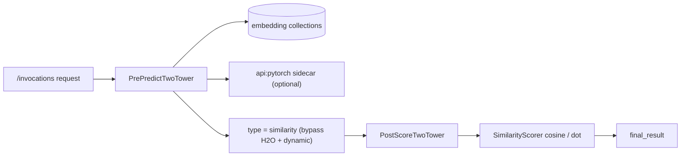
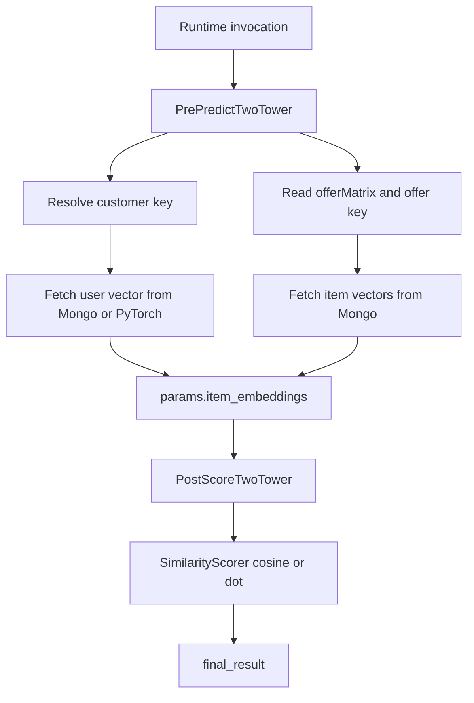

import { Callout } from 'nextra/components'

# Real-Time Scoring

The runtime serves two-tower recommendations **without loading any model**. It
compares a **user embedding** against **item embeddings** with cosine / dot
product and ranks the offer matrix. Embeddings are precomputed in MongoDB, or the
user vector is fetched live from a [PyTorch sidecar](/docs/modules/two_tower/pytorch).

The runtime deployment is bound to an **exported Two-Tower run**. The Workbench
deployment step emits the run id, embedding database, collection names, customer
lookup key, offer-matrix key, and plugin classes. `PrePredictTwoTower` uses those
properties to load vectors at request time.

## The `similarity` model type

A campaign tells the runtime to use two-tower scoring with one property:

```properties
predictor.model.type=similarity
```

When this is set, the runtime:

1. **skips H2O model scoring** (no `mojo.key` is required),
2. **skips dynamic-engagement scoring** (`loadCorporaDynamic` is bypassed), and
3. stamps the score result with `type="similarity"`,

then hands off to the post-score plugin. This is the single switch the deployment
step sets; everything else is plugin and embedding configuration.


```mermaid
flowchart LR
  req["/invocations request"] --> pre["PrePredictTwoTower"]
  pre --> mongo[(embedding collections)]
  pre --> sidecar["api:pytorch sidecar (optional)"]
  pre --> stamp["type = similarity (bypass H2O + dynamic)"]
  stamp --> post["PostScoreTwoTower"]
  post --> sim["SimilarityScorer cosine / dot"]
  sim --> fr["final_result"]
```

## The reusable `SimilarityScorer`

`com.ecosystem.algorithm.similarity.SimilarityScorer` is a pure, stateless helper
that **any** post-score plugin can call when the model type is `similarity`. It:

- detects similarity mode (`isSimilarity(...)`),
- extracts the user vector and per-offer item vectors,
- computes `cosine` (default) or `dot` similarity, and
- builds the sorted `final_result`.

Any existing plugin can adopt two-tower scoring with a single guard:

```java
if (SimilarityScorer.isSimilarity(predictModelMojoResult, params)) {
    return getTopScores(params, SimilarityScorer.apply(predictModelMojoResult, params, "cosine"));
}
```

## The plugins

| Plugin | Role |
| --- | --- |
| `PrePredictTwoTower` | loads the user vector + per-offer item vectors into `params` |
| `PostScoreTwoTower` | delegates to `SimilarityScorer`, then `getTopScores` |

`PrePredictTwoTower` resolves the **user embedding** in this order:

1. precomputed vector from the configured user embedding collection, keyed by
   `run_id` and the configured customer key;
2. otherwise, if `predictor.twotower.user.embed` is configured, a **live call**
   to the PyTorch sidecar (`ApiModelClient.embed(...)`).

Item vectors come from the configured item embedding collection, keyed by
`run_id` and the configured offer key (or from an `embedding` field on the offer
matrix).

## Runtime properties

Minimum production configuration:

```properties
predictor.model.type=similarity

predictor.twotower.run.id=tt_abc123
predictor.twotower.embedding.db=ecosystem_meta
predictor.twotower.user.collection=two_tower_user_embeddings
predictor.twotower.item.collection=two_tower_item_embeddings
predictor.twotower.customer.key=customer_id
predictor.twotower.offer.key=offer

plugin.prescore=com.ecosystem.plugin.customer.PrePredictTwoTower
plugin.postscore=com.ecosystem.plugin.customer.PostScoreTwoTower
```

Optional live user embedding via PyTorch:

```properties
predictor.twotower.user.embed=pytorch:http://ecosystem-notebooks:8010:customer_offer_retrieval_v1
```

This optional property is most useful when user vectors must be generated from
fresh request features. Item vectors should normally remain precomputed because
the offer catalogue is finite and can be re-exported after training.

## MongoDB embedding contract

| Collection | Document shape |
| --- | --- |
| `two_tower_user_embeddings` | `{ run_id, embedding_id, customer_id, embedding, embedding_dim, engine, model_id, normalized, updated_at }` |
| `two_tower_item_embeddings` | `{ run_id, embedding_id, offer, embedding, embedding_dim, engine, model_id, normalized, updated_at }` |

Item vectors may instead be attached to each offer-matrix entry as
`"embedding": [floats]`.

Recommended indexes:

```javascript
db.two_tower_user_embeddings.createIndex({ run_id: 1, customer_id: 1 }, { unique: true })
db.two_tower_item_embeddings.createIndex({ run_id: 1, offer: 1 }, { unique: true })
```

If your configured keys are not `customer_id` and `offer`, create the equivalent
indexes for those key fields.

## Worked example — campaign properties

```properties
predictor.name=two_tower_demo
predictor.model.type=similarity

# no mojo.key, and no dynamic_engagement corpora

plugin.prescore=com.ecosystem.plugin.customer.PrePredictTwoTower
plugin.postscore=com.ecosystem.plugin.customer.PostScoreTwoTower

predictor.twotower.run.id=tt_abc123
predictor.twotower.embedding.db=ecosystem_meta
predictor.twotower.user.collection=two_tower_user_embeddings
predictor.twotower.item.collection=two_tower_item_embeddings
predictor.twotower.customer.key=customer_id
predictor.twotower.offer.key=offer

# optional: live user-tower embedding via the PyTorch sidecar
predictor.twotower.user.embed=pytorch:http://ecosystem-notebooks:8010:customer_offer_retrieval_v1

predictor.offer.matrix={ ... }
```

## Real-time flow


```mermaid
flowchart TD
  Request["Runtime invocation"] --> Pre["PrePredictTwoTower"]
  Pre --> Customer["Resolve customer key"]
  Pre --> Offers["Read offerMatrix and offer key"]
  Customer --> UserVec["Fetch user vector from Mongo or PyTorch"]
  Offers --> ItemVecs["Fetch item vectors from Mongo"]
  UserVec --> Params["params.user_embedding"]
  ItemVecs --> Params["params.item_embeddings"]
  Params --> Post["PostScoreTwoTower"]
  Post --> Similarity["SimilarityScorer cosine or dot"]
  Similarity --> Result["final_result"]
```

## Scoring request and response

Request to the runtime (`POST /invocate`):

```json
{
  "campaign": "two_tower_demo",
  "sub-campaign": "default",
  "channel": "web",
  "customer": "user_1",
  "numberoffers": 3,
  "userid": "ecosystem",
  "in_params": { "input": ["customer_id"], "value": ["user_1"] }
}
```

Response (trimmed):

```json
{
  "final_result": [
    { "rank": 1, "result": { "offer": "ProductB", "offer_name": "ProductB", "score": 0.87 } },
    { "rank": 2, "result": { "offer": "ProductC", "offer_name": "ProductC", "score": 0.41 } }
  ],
  "explore": 0,
  "uuid": "..."
}
```

<Callout type="tip" title="Engine-agnostic">
  The runtime never loads a tower. Whether embeddings were produced by H2O
  `deepfeatures` or PyTorch, the runtime only does vector math — so latency stays
  flat and independent of model size.
</Callout>

See the [API Reference](/docs/modules/two_tower/api) for full request/response
samples and [PyTorch Serving](/docs/modules/two_tower/pytorch) for the online
embedding path.
