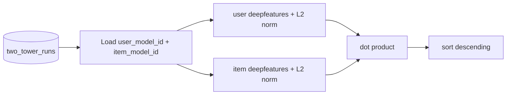

import { Callout } from 'nextra/components'

# Offline Scoring

Offline scoring validates a run and produces recommendations in bulk, before any
real-time deployment. Both paths use the same math:
**dot product of L2-normalized `deepfeatures` embeddings**.

## Concept test (fast path)

A concept test ranks a fixed list of offers for a single customer. It is the
quickest way to confirm a run's data and metadata are sound.



Request (`POST /api/v1/algorithms/two-tower/concept-test`):

```json
{
  "run_id": "tt_abc123",
  "customer_id": "user_1",
  "offers": ["ProductA", "ProductB", "ProductC"]
}
```

Response:

```json
{
  "success": true,
  "run_id": "tt_abc123",
  "customer_id": "user_1",
  "ranked": [
    { "offer": "ProductB", "score": 0.87 },
    { "offer": "ProductC", "score": 0.41 },
    { "offer": "ProductA", "score": 0.12 }
  ],
  "detail": "H2O DL tower scoring"
}
```

<Callout type="info" title="Default context">
  When price/rank/score are not supplied for a concept test, the defaults
  `price=0.0`, `rank=1.0`, `score=0.0` are used so that ranking reflects the
  identity embeddings.
</Callout>

## Batch scoring

Batch scoring writes top-**K** recommendations per customer into a MongoDB
collection. It iterates distinct customers and offers for the run's predictor and
applies the concept-test ranking to each customer.

Request (`POST /api/v1/algorithms/two-tower/batch-score`, async job):

```json
{
  "run_id": "tt_abc123",
  "top_k": 10,
  "max_users": 5000,
  "scores_collection": "two_tower_scores"
}
```

The job id is returned; poll `GET /api/v1/jobs/{job_id}` for progress. Each
output document:

```json
{
  "run_id": "tt_abc123",
  "customer_id": "user_1",
  "ranked": [
    { "offer": "ProductB", "score": 0.87 },
    { "offer": "ProductC", "score": 0.41 }
  ],
  "created_at": "2026-06-30T00:00:00Z"
}
```

| Parameter | Default | Meaning |
| --- | --- | --- |
| `top_k` | `10` | recommendations kept per customer |
| `max_users` | `5000` | cap on customers processed |
| `scores_collection` | `two_tower_scores` | output collection |
| `scores_database` | run's source DB | output database |

## From offline to online

Offline scoring proves the embeddings are meaningful. To serve recommendations
per request — with logging, audit, and the campaign contract — move to
[Real-Time Scoring](/docs/modules/two_tower/runtime), which ranks the offer
matrix using precomputed (or live PyTorch) embeddings.
