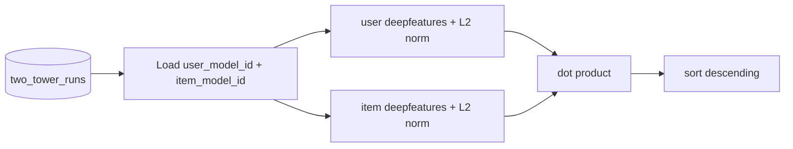

import { Callout } from 'nextra/components'

# Offline Scoring

Offline scoring validates a run and produces recommendations in bulk, before any
real-time deployment. Both paths use the same math:
**dot product of L2-normalized `deepfeatures` embeddings**.

In Workbench, all scoring jobs should be tied back to the saved Two-Tower
configuration (`config_id`). The `/two-tower` page can then show a job-history
table for the selected configuration: train jobs, concept tests, batch scores,
embedding exports, and full pipeline runs.

## Concept test (fast path)

A concept test ranks a fixed list of offers for a single customer. It is the
quickest way to confirm a run's data and metadata are sound.


```mermaid
flowchart LR
  run[(two_tower_runs)] --> load["Load user_model_id + item_model_id"]
  load --> uemb["user deepfeatures + L2 norm"]
  load --> iemb["item deepfeatures + L2 norm"]
  uemb --> dot["dot product"]
  iemb --> dot
  dot --> sort["sort descending"]
```

Request (`POST /api/v1/algorithms/two-tower/concept-test`):

```json
{
  "run_id": "tt_abc123",
  "customer_id": "user_1",
  "offers": ["ProductA", "ProductB", "ProductC"]
}
```

Response:

```json
{
  "success": true,
  "run_id": "tt_abc123",
  "customer_id": "user_1",
  "ranked": [
    { "offer": "ProductB", "score": 0.87 },
    { "offer": "ProductC", "score": 0.41 },
    { "offer": "ProductA", "score": 0.12 }
  ],
  "detail": "H2O DL tower scoring"
}
```

<Callout type="info" title="Default context">
  When price/rank/score are not supplied for a concept test, the defaults
  `price=0.0`, `rank=1.0`, `score=0.0` are used so that ranking reflects the
  identity embeddings.
</Callout>

For a PyTorch-trained run, the concept test uses the same request shape but
obtains embeddings by calling the notebooks sidecar:

```json
{
  "model_id": "customer_offer_retrieval_v1",
  "instances": [
    { "tower": "user", "customer_id": "user_1", "price": 0, "rank": 1, "score": 0 },
    { "tower": "item", "offer": "ProductA", "price": 0, "rank": 1, "score": 0 }
  ]
}
```

The Workbench backend computes the dot products and returns the same ranked
response shape.

## Batch scoring

Batch scoring writes top-**K** recommendations per customer into a MongoDB
collection. It iterates distinct customers and offers for the run's predictor and
applies the concept-test ranking to each customer.

Request (`POST /api/v1/algorithms/two-tower/batch-score`, async job):

```json
{
  "run_id": "tt_abc123",
  "top_k": 10,
  "max_users": 5000,
  "scores_collection": "two_tower_scores"
}
```

The job id is returned; poll `GET /api/v1/jobs/{job_id}` for progress. Each
output document:

```json
{
  "run_id": "tt_abc123",
  "customer_id": "user_1",
  "ranked": [
    { "offer": "ProductB", "score": 0.87 },
    { "offer": "ProductC", "score": 0.41 }
  ],
  "created_at": "2026-06-30T00:00:00Z"
}
```

| Parameter | Default | Meaning |
| --- | --- | --- |
| `top_k` | `10` | recommendations kept per customer |
| `max_users` | `5000` | cap on customers processed |
| `scores_collection` | `two_tower_scores` | output collection |
| `scores_database` | run's source DB | output database |

## Embedding export for real-time scoring

Batch scoring writes recommendations. **Embedding export writes vectors.** The
runtime uses the vector collections, not the batch-score recommendation output.

Request (`POST /api/v1/algorithms/two-tower/export-embeddings`, async job):

```json
{
  "run_id": "tt_abc123",
  "config_id": "customer_offer_retrieval_v1",
  "embedding_database": "ecosystem_meta",
  "user_embedding_collection": "two_tower_user_embeddings",
  "item_embedding_collection": "two_tower_item_embeddings",
  "customer_key_field": "customer_id",
  "offer_key_field": "offer",
  "max_users": 100000,
  "max_items": 100000
}
```

The export job:

1. reads distinct customers and offers from the run's source collection,
2. computes normalized user/item embeddings using the run engine (`h2o` or
   `pytorch`),
3. bulk-upserts vectors into MongoDB, and
4. updates `ecosystem_meta.two_tower_runs` with export counts and collection
   names.

User embedding document:

```json
{
  "run_id": "tt_abc123",
  "embedding_id": "tt_abc123:user:user_1",
  "customer_id": "user_1",
  "embedding": [0.11, 0.20, 0.07],
  "embedding_dim": 32,
  "engine": "h2o",
  "model_id": "two_tower_user_tt_abc123",
  "normalized": true,
  "updated_at": "2026-06-30T00:00:00Z"
}
```

Item embedding document:

```json
{
  "run_id": "tt_abc123",
  "embedding_id": "tt_abc123:item:ProductB",
  "offer": "ProductB",
  "embedding": [0.06, 0.44, 0.12],
  "embedding_dim": 32,
  "engine": "h2o",
  "model_id": "two_tower_item_tt_abc123",
  "normalized": true,
  "updated_at": "2026-06-30T00:00:00Z"
}
```

Use idempotent upserts keyed by `(run_id, customer_id)` and `(run_id, offer)` so
re-exporting the same run replaces previous vectors.

<Callout type="warning" title="Export database vs runtime default">
  The export's `embedding_database` defaults to the **`logging`** database, while
  the runtime plugin defaults to **`ecosystem_meta`**. Set
  `predictor.twotower.embedding.db` in the deployment to the database you
  exported to (as in the example above).
</Callout>

## From offline to online

Concept testing proves the embeddings are meaningful. Exporting embeddings makes
them available to real-time scoring. To serve recommendations per request — with
logging, audit, and the campaign contract — move to
[Real-Time Scoring](/docs/modules/two_tower/runtime), which ranks the offer
matrix using the exported Mongo vectors (or, optionally, a live PyTorch user
embedding).

At serve time the payload is richer than the offline `{offer, score}` shape:
each result row is assigned from the offer matrix (`offer`, `offer_id`,
`offer_name`, `offer_name_desc`, `price`, `cost`, numeric `offer_value`) plus
the request `uuid`, similarity `p`, `explore`, and `spend_limit` when a budget
is configured. Per-offer eligibility rules and request whitelists are applied
through the `additionalOfferChecks` hook in `PostScoreTwoTower` — see
[Real-Time Scoring](/docs/modules/two_tower/runtime#per-offer-eligibility-checks).
