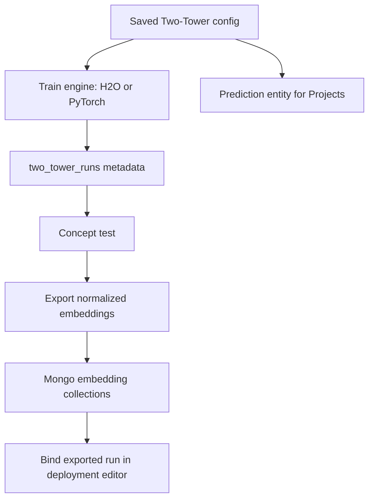

import { Callout } from 'nextra/components'

# Model Training

Training is operated from the Workbench **`/two-tower`** page. The page is
configuration-first: users save a Two-Tower metadata configuration, select it
from a table, run jobs from that configuration, and review the job history for
that exact configuration.

## Saved Two-Tower configuration

A configuration captures every parameter needed to repeat the process:

```json
{
  "config_id": "customer_offer_retrieval_v1",
  "name": "Customer Offer Retrieval v1",
  "engine": "h2o",
  "source": {
    "database": "logging",
    "collection": "ecosystemruntime_flatten",
    "predictor": "my_predictor",
    "from_date": "2026-01-01",
    "to_date": "2026-06-01"
  },
  "features": {
    "target_column": "accepted",
    "user_features": ["customer_id", "price", "rank", "score"],
    "item_features": ["offer", "price", "rank", "score"],
    "categorical_columns": ["customer_id", "offer"]
  },
  "keys": {
    "customer_key_field": "customer_id",
    "offer_key_field": "offer"
  },
  "training": {
    "embedding_dim": 32,
    "epochs": 5,
    "stopping_rounds": 3,
    "batch_size": 256,
    "learning_rate": 0.001,
    "hidden": [128, 64]
  },
  "embedding_export": {
    "database": "logging",
    "user_collection": "two_tower_user_embeddings",
    "item_collection": "two_tower_item_embeddings",
    "metric": "cosine",
    "normalized": true
  },
  "deployment_defaults": {
    "model_type": "similarity",
    "pre_score_class_text": "PrePredictTwoTower.java",
    "post_score_class_text": "PostScoreTwoTower.java"
  },
  "prediction_entity": {
    "predict_id": "customer_offer_retrieval_v1"
  }
}
```

The configuration should be stored with a unique `config_id`. Jobs created from
the UI or Python runner include `context.config_id`, making it possible to show
all train, concept-test, export, and pipeline jobs for the selected
configuration.

When a train request carries a `config_id`, the backend **merges the saved
configuration into the request server-side** — source, features, keys, training
hyperparameters, and export settings are filled from the saved config, and any
value supplied explicitly on the request overrides the saved one. Callers only
need to send the fields they want to change.

The `source` block usually points to **one interaction dataset**:
`logging.ecosystemruntime_flatten`. The `features` and `keys` blocks tell
Workbench how to split that one dataset into a user-tower feature view and an
item-tower feature view. Use separate user/profile or product/catalog datasets
only when those attributes are not already materialized into the interaction
rows; the final training frame still needs the interaction label and both sides'
features together.

The `/two-tower` page also links the config to the existing Workbench
`predictions` entity. That keeps Projects using `project_predictors` for the
deployable predictor asset, while `two_tower_runs` remains the operational
history for training and export jobs.

## Workbench process



The `/two-tower` dashboard should expose:

- a table of saved configurations,
- an editable selected-configuration panel,
- action buttons for train, concept test, export embeddings, and full pipeline,
- a per-configuration job history table, and
- latest run/export status such as `run_id`, engine, row count, AUC, exported
  user vectors, exported item vectors, and updated date.

## Dual H2O Deep Learning towers

The built-in trainer fits **two `H2ODeepLearningEstimator` models** against the
same training frame:

```text
user tower:  model_id = two_tower_user_{run_id}
item tower:  model_id = two_tower_item_{run_id}
```

Both share the same configuration:

- `hidden = [embedding_dim]` — a single hidden layer whose width **is** the
  embedding dimension.
- `activation = "Rectifier"`
- `categorical_encoding = "one_hot_internal"`
- `stopping_metric = "AUC"` (binomial classification on `accepted`)
- `seed = 42`, with an 80/20 train/validation split.

For richer datasets, add customer attributes to `user_features` and product
attributes to `item_features`. Keep the key fields (`customer_key_field` and
`offer_key_field`) aligned with the values the runtime will use to fetch
embeddings during real-time scoring.

## Hyperparameters

| Parameter | Default | Range | Meaning |
| --- | --- | --- | --- |
| `embedding_dim` | `32` | 4–256 | width of the shared embedding space |
| `epochs` | `5` | 1–500 | training epochs per tower |
| `stopping_rounds` | `3` | 0–50 | early-stopping patience |
| `predictor` | *(required)* | — | which interactions to train on |
| `from_date` / `to_date` | `null` | — | optional date window |
| `run_id` | auto | — | identifier for this training run |

## Producing embeddings

After training, an embedding for any customer or offer is obtained by reading the
**first hidden layer** of the relevant tower:

```python
# user embedding
u = user_model.deepfeatures(user_frame, layer=0)   # p-dim activations
u = u / norm(u)                                     # L2 normalize

# item embedding
v = item_model.deepfeatures(item_frame, layer=0)
v = v / norm(v)

score = dot(u, v)                                   # cosine on unit vectors
```

This is the exact computation the offline concept test and batch scoring use.

## PyTorch training engine

PyTorch training runs through the `ecosystem-notebooks` `/pytorch` sidecar. From
Workbench, a PyTorch configuration is translated into a `POST /pytorch/train`
request with `model_type="two_tower"`.

```json
{
  "model_id": "customer_offer_retrieval_v1",
  "model_type": "two_tower",
  "async": true,
  "data": {
    "source": {
      "database": "logging",
      "collection": "ecosystemruntime_flatten",
      "pipeline": [
        { "$match": { "predictor": "my_predictor" } },
        { "$project": { "_id": 0, "customer_id": 1, "offer": 1, "price": 1, "rank": 1, "score": 1, "accepted": 1 } }
      ]
    },
    "target_column": "accepted",
    "categorical_columns": ["customer_id", "offer"]
  },
  "hyperparameters": {
    "epochs": 25,
    "batch_size": 256,
    "learning_rate": 0.001,
    "embedding_dim": 32,
    "hidden": 64,
    "user_features": ["customer_id", "price", "rank", "score"],
    "item_features": ["offer", "price", "rank", "score"],
    "user_id_column": "customer_id",
    "item_id_column": "offer"
  }
}
```

Artifacts are stored by the notebooks sidecar under the existing
`DATA_DIR/pytorch_models/{model_id}` path. Workbench still records the run in
`ecosystem_meta.two_tower_runs`, with `engine="pytorch"`, the model id, sidecar
URL, source metadata, feature columns, keys, embedding dimension, metrics, and
export metadata.

## Artifacts

| Artifact | Format | Location |
| --- | --- | --- |
| In-cluster models | H2O model objects | H2O cluster (used for `deepfeatures`) |
| MOJO files | `{model_id}.zip` | `H2O_MODELS` directory |
| PyTorch artifacts | `user_tower.pt`, `item_tower.pt`, preprocessing metadata | `DATA_DIR/pytorch_models/{model_id}` |
| Run metadata | MongoDB document | `ecosystem_meta.two_tower_runs` |

The `two_tower_runs` document records everything needed to reproduce or score a
run:

```json
{
  "run_id": "tt_abc123",
  "config_id": "customer_offer_retrieval_v1",
  "engine": "h2o",
  "database": "logging",
  "flatten_collection": "ecosystemruntime_flatten",
  "user_column": "customer_id",
  "item_column": "offer",
  "predictor": "my_predictor",
  "embedding_dim": 32,
  "epochs": 5,
  "stopping_rounds": 3,
  "user_model_id": "two_tower_user_tt_abc123",
  "item_model_id": "two_tower_item_tt_abc123",
  "user_auc": 0.72,
  "item_auc": 0.68,
  "n_rows": 150000,
  "embedding_database": "logging",
  "user_embedding_collection": "two_tower_user_embeddings",
  "item_embedding_collection": "two_tower_item_embeddings",
  "customer_key_field": "customer_id",
  "offer_key_field": "offer",
  "updated_at": "2026-06-30T00:00:00Z"
}
```

## Exporting embeddings for the runtime

Real-time scoring reads **precomputed embedding vectors** from MongoDB (see
[Real-Time Scoring](/docs/modules/two_tower/runtime)). The expected collections:

| Collection | Document shape |
| --- | --- |
| `two_tower_user_embeddings` | `{ run_id, embedding_id, customer_id, embedding, embedding_dim, engine, model_id, normalized, updated_at }` |
| `two_tower_item_embeddings` | `{ run_id, embedding_id, offer, embedding, embedding_dim, engine, model_id, normalized, updated_at }` |

Item vectors may alternatively ride on the offer matrix as an `embedding` field.

<Callout type="info" title="Exporting vectors">
  The training run produces the towers; populating the embedding collections is
  an explicit export job. H2O exports use `deepfeatures(layer=0)`. PyTorch
  exports call `/pytorch/invocations` with `tower="user"` or `tower="item"`.
  Both paths write the same normalized Mongo document shape.
</Callout>

### Engine parity contract

Both engines honor the same export contract so the runtime never needs to know
which engine produced a run:

- **Identical document shape** — the fields shown above, with `engine` set to
  `"h2o"` or `"pytorch"`, and the same `{run_id, key}` compound indexes.
- **L2-normalized vectors** when `embedding_export.normalized` is set. PyTorch
  vectors are normalized in the workbench export path (the sidecar returns raw
  activations); H2O vectors are normalized the same way after `deepfeatures`.
- **Export frames are built from the run's recorded features.** The exporter
  reads `user_features` / `item_features` from the `two_tower_runs` document and
  fills feature values from sampled source rows — the same approach for both
  engines. (Earlier versions padded H2O export frames with hardcoded zeros;
  re-exporting a run trained before this fix will produce different — correct —
  vectors, so expect rankings to shift on the next export.)
- **Same-run invariant** — the user and item vectors for a `run_id` always come
  from one engine and one training run. Never mix engines within a run id: the
  towers only share an embedding space when trained together.

The `pytorch_mlrun` engine value is **reserved** and rejected at request
validation (HTTP 422): the MLRun trainer sidecar has no two-tower handler.
Use `pytorch` (the notebooks sidecar) for PyTorch training.

## Python runner

Power users can run the same process from a script instead of the UI:

```bash
python backend/scripts/two_tower_pipeline.py \
  --config-id customer_offer_retrieval_v1 \
  --steps train,concept-test,export-embeddings \
  --wait
```

The runner loads the saved configuration (or a local JSON/YAML file), calls the
same Workbench APIs as the UI, polls jobs, and prints JSON containing `config_id`,
`run_id`, job ids, final statuses, embedding export counts, and deployment
property hints.

See [PyTorch Serving](/docs/modules/two_tower/pytorch) and the
[API Reference](/docs/modules/two_tower/api) for complete request bodies.

Next: [Offline Scoring](/docs/modules/two_tower/scoring).
