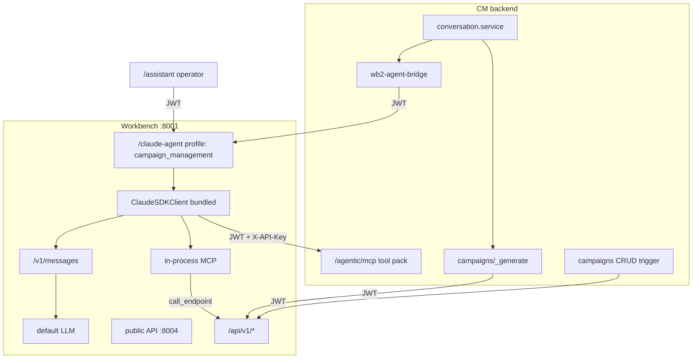

# Claude Agent on Workbench

Claude Agent is the Workbench **operator** surface: in-app `/assistant`, Campaign Management private chat turns, and external Claude Code / Agent SDK attach. It is **not** a ninth product agent and does not replace EcoGentic customer chat.

Branding: use **Claude Agent** (not “Claude Code Agent”) per Anthropic guidelines.

## Usage map



| Consumer | Needs from Workbench | Does **not** need |
| --- | --- | --- |
| **Campaign Management** | Private `/claude-agent/*` with `tool_profile: campaign_management` (CM MCP tool pack + read-only Workbench subset); `/campaigns/_generate/*`; campaigns CRUD/trigger; JWT | Workbench mutating tools (hard-denied on this profile); Claude CLI in the CM image |
| **Workbench `/assistant`** | Ready Agent SDK + default LLM + in-process MCP | CM |
| **External Claude Code / Agent SDK** | `ANTHROPIC_BASE_URL` → Workbench host `:8001` (`POST /v1/messages`); optional dual-auth `POST /mcp` | Workbench in-image `_bundled/claude` (client supplies its own SDK/CLI) |

## Packaging

The [Claude Agent SDK](https://code.claude.com/docs/en/agent-sdk/overview) **bundles** the Claude binary (`_bundled/claude`). Workbench Docker uses **`python:3.14-slim` (Debian/glibc)** so the platform wheel includes that binary. Alpine/musl images are unsupported for the in-app Operator.

- No Anthropic API key in the image.
- Model traffic always uses Workbench `POST /v1/messages` → default LLM (`LLMService.get_config("default")`).
- Readiness: `GET /api/v1/claude-agent/status` → `ready: true` when enabled + default LLM + SDK + resolved CLI.

## Catalog agents

Admin Agents list product agents (spend/money personality, interaction science, intelligent sales, real-time recommender, conversational, EcoGentic, etc.) plus Claude Operator. Operator reaches them via in-process MCP tools and `call_endpoint` on private `/api/v1/*` paths.

Prefer:

```text
GET  /api/v1/campaigns
POST /api/v1/algorithms/money-personality/process   (confirm=true)
POST /api/v1/algorithms/sentimental-equilibrium/process
```

`/public/v1/...` paths are accepted and remapped where needed. See [MCP Support](/docs/runtime/mcp) for Workbench MCP details.

## Campaign Management

Set:

```bash
# CM side — reach the WB2 agent runtime
WORKBENCH_PRIVATE_API_BASE_URL=http://ecosystem-workbench2:8001/api/v1
CM_AGENT_MCP_API_KEY=<optional; hardens CM /agentic/mcp>

# WB2 side — mount the CM tool pack for tool_profile: campaign_management
AGENT_APP_CM_MCP_URL=http://ecosystem-campaign-management:54310/api/extensions/campaign-platform/agentic/mcp
AGENT_APP_CM_MCP_API_KEY=<same value as CM_AGENT_MCP_API_KEY>
```

CM bridges chat turns to private Claude with `tool_profile: campaign_management`
(flag `CAMPAIGN_PLATFORM_AGENTIC_WB2_RUNTIME`). The WB2 runtime plans the turn and
calls back into CM's `/agentic/mcp` tool pack with the acting user's JWT — campaign
mutations apply through CM's own intent pipeline (undo checkpoints + audit), and the
profile hard-denies Workbench mutations. Generative analyze/execute and campaign ops
use the same private API base with the user JWT.

## External attach

| Surface | Auth | Purpose |
| --- | --- | --- |
| `POST /v1/messages` | Public path; model remapped to default LLM | What external Agent SDK / Claude Code calls when `ANTHROPIC_BASE_URL` = Workbench |
| `POST /mcp` | `Authorization: Bearer` + `X-API-Key` | Full HTTP MCP tool set |

Copy live snippets from Workbench **Administration → Agents → Access**.

## Ontology-aware Q&A

When Ontology Management is enabled, Operator MCP includes:

| Tool | Role |
| --- | --- |
| `list_ontologies` / `describe_ontology` | Discover ontologies and enabled mappings |
| `resolve_ontology_term` | Map business terms → properties / fields |
| `generate_ontology_query` | Build a read-only Mongo pipeline or Trino SQL from Accepted mappings |
| `query_data_via_ontology` | Execute (`mode=auto\|filter\|aggregate`) against the mapped source |

Example: “Using xyz ontology, how many customers spent money last month?” →
resolve ontology by name → generate query → execute → report tool counts only.

Workbench Ontology Overview **Test** opens the agent drawer with that prompt
prepared (composer filled, not auto-sent).

Related: [MCP Support](/docs/runtime/mcp) (Operator in-process vs HTTP `/mcp` vs stdio SDK).
